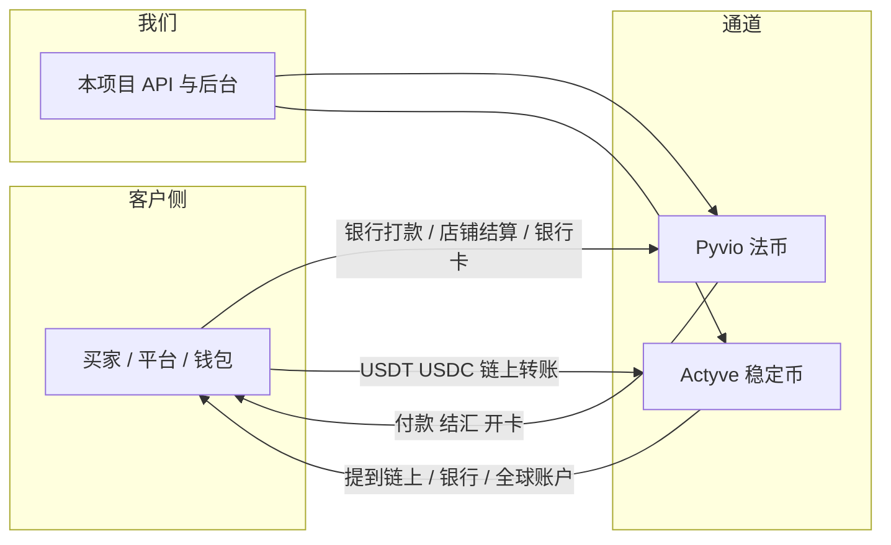

# Kaloq · 支付聚合平台

> **当前 V1 需求基线**：[一眼看懂的功能清单](docs/v1/README.md) · [详细需求与架构](docs/v1/detailed-requirements.md)。首家为乌兹别克斯坦商户，目标 UZS 收款及 USDT 钱包；包含收钱 Recv、Sent 法转法/数转数、自有账户法转数/数转法、Pyvio KYC 资料快照复用、成员权限、交易明细和 Kaloq API 文档。网页及接入方均调用 Kaloq API，由 Kaloq 后端封装 Pyvio。**只接 Pyvio；资金能力和具体币种/网络以沙盒确认为准。** 下方为历史研究资料，发生冲突时以 `docs/v1/` 为准。

> **2026-10-05 程序架构提案**：依据 `Kaloq_Business_Architecture.pdf` 与最新多 Provider 需求，见 [Kaloq 程序架构图与模块边界](docs/program-architecture.md)。下方 Pyvio + Actyve 方案保留为历史业务研究；新增提案不将其通道能力、自建钱包或库存模式视为已确认前提。

> **一句话**：这是和「用币买股票」那个 `eopay` **分开的**新支付项目。通道换成两家官方服务商：**Pyvio（湃沃）做法币全球账户 / 付款 / 换汇 / 收单 / 虚拟卡**，**Actyve 做稳定币进出与链上划转**。
>
> **工作代号 `eopay-pay`**（最终产品名待定）
>
> **旧版聚合需求**：[docs/aggregation-requirements.md](docs/aggregation-requirements.md)（历史双通道研究）  
> **EOPay 功能清单**：[docs/EOPay.md](docs/EOPay.md)（聚合之后对外有哪些能力）  
> **服务器架构**：[docs/server-architecture.md](docs/server-architecture.md)  
> **开发前准备**：[docs/dev-preparation.md](docs/dev-preparation.md)  
> **通道研究**：[docs/vendor-research.md](docs/vendor-research.md) · **定价**：[docs/pricing.md](docs/pricing.md) · **成本粗估**：[docs/platform-sketch.md](docs/platform-sketch.md)

它和旁边的 `eopay` 仓库不是一回事：

| 仓库 | 做什么 |
|------|--------|
| `eopay` | 合作方 App 用 USDC 买卖股票 |
| **`eopay-pay`（本仓库）** | 接 Pyvio + Actyve，做跨境收付款 |

以前 `eopay` 里归档的 BVNK / Layer1 方案，**不照搬实现**。那套里「虚拟账户、换汇、链上、收单」这些能力，可以对照下面两家的官方能力重新选型。

---

## 0. 资料怎么放

| 位置 | 是什么 |
|------|--------|
| **[`docs/v1/README.md`](docs/v1/README.md)** | **当前 V1 一页功能清单与编码交接说明** |
| **[`docs/v1/detailed-requirements.md`](docs/v1/detailed-requirements.md)** | **当前 V1 详细需求、架构、开发顺序与验收** |
| **[`docs/program-architecture.md`](docs/program-architecture.md)** | 通用可扩展架构；本期范围以 `docs/v1/` 为准 |
| **[`docs/EOPay.md`](docs/EOPay.md)** | **EOPay 平台功能清单：调 Pyvio / Actyve 之后对外提供什么** |
| **[`docs/aggregation-requirements.md`](docs/aggregation-requirements.md)** | 历史：Pyvio + Actyve 聚合需求研究 |
| **[`docs/server-architecture.md`](docs/server-architecture.md)** | **我们服务器怎么部署、怎么调度两家 API** |
| **[`docs/market-uzbekistan.md`](docs/market-uzbekistan.md)** | **甲方新方向：乌兹别克斯坦跨境支付机会分析** |
| **[`docs/dev-preparation.md`](docs/dev-preparation.md)** | **开发前要备齐的东西：账号、密钥、决定、服务器、文档** |
| **[`docs/vendor-research.md`](docs/vendor-research.md)** | 两家官方文档研究笔记 |
| **[`docs/pricing.md`](docs/pricing.md)** | 通道公开费率口径 + 我们聚合 API 怎么定价 |
| **[`docs/platform-sketch.md`](docs/platform-sketch.md)** | 做成 API 平台的成本与结构粗估（工程向） |
| 官方网站 | 以官网为准，笔记只作翻译和对照 |

官方入口：

| 厂商 | 用途 | 链接 |
|------|------|------|
| Pyvio | 接口文档 | https://developer-doc.pyvio.com |
| Pyvio | 中文说明（怎么用） | https://docs.pyvio.com |
| Actyve | 接口文档 | https://developer-doc.actyve.io |

---

## 1. 两家分别是干什么的

用最直白的话说：

**Pyvio = 法币的全球收银台 + 银行账户。**  
帮出海企业在很多国家开「本地收款账户」，收到美元、港币、欧元、越南盾等；再付款给供应商、结汇、开虚拟卡。面向东南亚 / 拉美 / 非洲等新兴市场。

**Actyve = 稳定币钱包 + 出入金。**  
给你链上地址（Tron、以太坊、Solana 等），收 USDT / USDC；再提到链上地址、提到银行账户、或提到 Pyvio 那种全球账户。官网原话是：把传统支付和分布式账本合在一起。

两家文档长得几乎一样（同样的 RSA 签名、同样的错误码写法）。Actyve 提现里甚至有一种类型叫 `GlobalAccount`。大概率是同一体系里的「法币产品」和「稳定币产品」，但**合同、账号、牌照仍要当两套系统对接**。

---

## 2. Pyvio 能做什么（法币）

账户结构可以记四句话：

1. **Client**：一个实名主体（做完 KYC）。
2. **Unit**：这个主体下面的业务格子。钱、账户、付款都在 Unit 里。可以开多个 Unit 把资金隔开。
3. **VA / GA**：全球收款账户。只负责「别人打钱进来」，**自己不存余额**。
4. **钱包**：每个 Unit、每个币种一个钱包。VA 收到的钱会汇总进对应币种钱包，付款从钱包出。

主流程：

| 能力 | 人话 |
|------|------|
| 开户 | 提交 KYC，状态会变成待审 / 通过 / 打回补材料 |
| 收款 | 先开全球账户，别人打款进来，用 webhook 通知你 |
| B2C 收款 | 电商平台结算款（要先建店铺，再绑 VA） |
| B2B 收款 | 海外买家银行回款（个人用户不能用） |
| 付款 / 提现 | 从钱包付给银行账户或电子钱包，可直接错币种付 |
| 换汇 | 先锁 60 秒汇率，再下单；也可付款时顺带换 |
| 结汇人民币 | 要上传贸易订单，审核通过才有额度 |
| 收单收银台 | 跳转页面让买家填卡号，支持 3D 验证 |
| 湃付卡 | 申请虚拟卡、充值、冻结、查流水 |

环境：

- 沙箱：`https://sandbox-api.pyvio.com`
- 生产：`https://api.pyvio.com`

接入前要向 Pyvio 要：`app_id`、`app_secret`、双方 RSA 公钥、IP 白名单。POST 请求要带 `Sign` 和 `X-Timestamp`。子商户还要带 `X-Unit-Id`。

---

## 3. Actyve 能做什么（稳定币）

账户侧先拿链上地址，再看各链余额：

- 链：Tron、Ether、Solana、Polygon、Base、TON、BNB、Arbitrum
- 币：文档示例以 **USDT / USDC** 为主
- 余额按「某条链上的某个地址」列出

主流程：

| 能力 | 人话 |
|------|------|
| 入金 | 别人把稳定币打到你的链上地址，系统 webhook 通知 |
| 出金 | 三种：提到链上地址、提到银行账户、提到全球账户 |
| 换汇 | USDT/USDC ↔ USD/HKD（出金若要换汇，先查汇率） |
| 收款人 | 法币收款人 + 链上收款人两套 |
| 收单 Acquire | 为入金建单；链上每笔入金会再通知一次 |

环境：

- 沙箱：`https://sandbox-api.actyve.io`
- 生产：`https://api.actyve.io`

签名规则和 Pyvio 同一套：`app_id + timestamp + body`，SHA256WithRSA，放到请求头 `Sign`。

---

## 4. 产品方向（已澄清）

我们要做的是 **聚合层**，不是分别接两家、也不是自建 BVNK：

- 合作方只看见：客户、钱包、收款方式、付款、统一通知  
- Pyvio / Actyve 是通道，按「法币还是稳定币」在内部路由  
- 第一期边界、路由规则、待拍板事项见 [aggregation-requirements.md](docs/aggregation-requirements.md)
- 我们服务器怎么调度两家 API，见 [server-architecture.md](docs/server-architecture.md)

工程量和成本粗估仍见 [platform-sketch.md](docs/platform-sketch.md)。

---

## 文档版本

- **v0.8**：EOPay 聚合功能清单，见 [`docs/EOPay.md`](docs/EOPay.md)
- **v0.7**：Pyvio 商务口头承诺机构提价/分成后台，见 [`docs/pricing.md`](docs/pricing.md) 第 4 节
- **v0.6**：乌兹别克斯坦市场机会，见 [`docs/market-uzbekistan.md`](docs/market-uzbekistan.md)
- **v0.5**：开发前准备清单，见 [`docs/dev-preparation.md`](docs/dev-preparation.md)
- **v0.4**：服务器架构，见 [`docs/server-architecture.md`](docs/server-architecture.md)
- **v0.3**：写清「聚合」需求，见 [`docs/aggregation-requirements.md`](docs/aggregation-requirements.md)
- **v0.2**：API 平台范围与成本粗估，见 [`docs/platform-sketch.md`](docs/platform-sketch.md)
- **v0.1**：研究 Pyvio / Actyve 官方文档，新建独立仓库 `eopay-pay`
