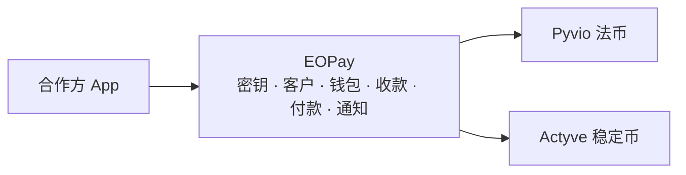
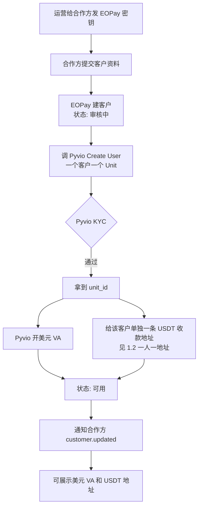
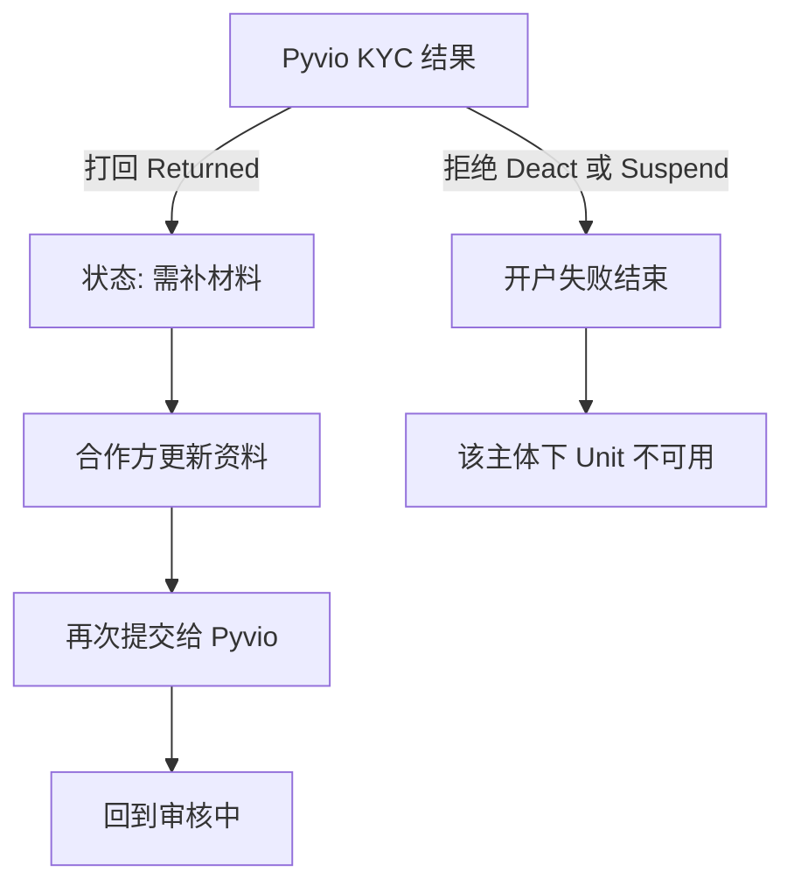
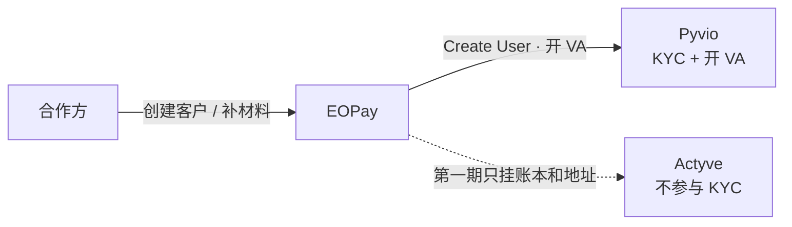
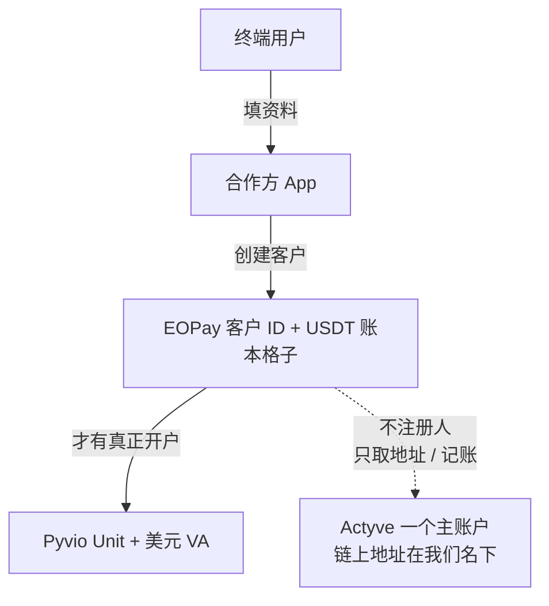
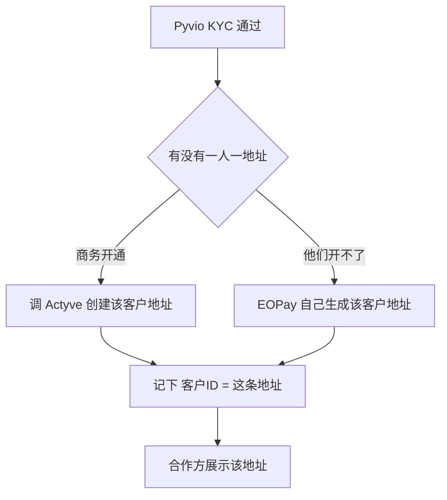
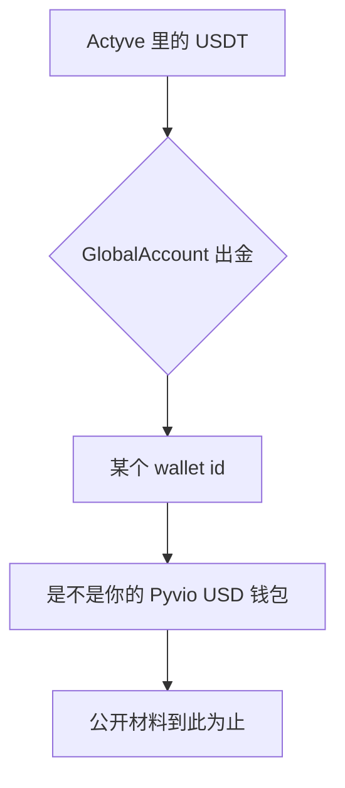

# EOPay · 平台功能清单

> **EOPay** 就是我们要做的聚合平台。  
> 合作方只对接 EOPay 一套 API / 一套通知。  
> 背后：法币调 **Pyvio**，稳定币调 **Actyve**。合作方文档里不出现这两家名字。
>
> 钱仍在通道托管。我们做：路由、账本、通知、对账、手续费分成。  
> 通道研究见 [vendor-research.md](vendor-research.md)；第一期边界见 [aggregation-requirements.md](aggregation-requirements.md)。

期次说明：

| 标记 | 意思 |
|------|------|
| **P1** | 第一期就做 |
| **P2** | 通道有能力，第二期再包进来 |
| **待确认** | 通道能做，但商务/互转还没钉死，不能对外承诺 |

---

## 1. 合作方眼里的 EOPay



对外对象只有这些：商户、客户、钱包、收款方式、付款单、通知。  
没有「Pyvio Unit」「Actyve 地址对象」这类原始名词。

### 1.1 开户流程（合作方的客户）

这里的「用户」= 合作方 App 下面的**客户**（企业或个人）。  
不是合作方自己来 EOPay 拿密钥（那一步更早，由我们运营开通商户）。

对外只有三个状态：**审核中 / 可用 / 需补材料**。  
合作方看不到 Pyvio、Actyve。

**主路径（通过）：**



**打回 / 拒绝：**



**谁调谁：**



Pyvio 审完用 webhook 通知 EOPay，EOPay 再通知合作方（图上不往回画，以免交叉）。

分步说明：

| 步 | 谁做 | 做什么 | 背后 |
|----|------|--------|------|
| 0 | 我们运营 | 给合作方发 EOPay 的 API Key、配通知地址 | 不发 Pyvio / Actyve 密钥 |
| 1 | 合作方 | `创建客户`：营业执照或身份证等 | EOPay 落库 |
| 2 | EOPay | 调 Pyvio 开户，状态变审核中 | `Create User`，头上以后带这个客户的 `X-Unit-Id` |
| 3 | Pyvio | 人工/沙箱审核 KYC | 通知我们；打回则合作方走 `更新客户` |
| 4 | EOPay | KYC 通过后开美元 VA | Pyvio `Open Global Account`（第一期 Direct Payment 或 B2B，以商务为准） |
| 5 | EOPay | 给这个客户挂上**单独的** USDT 收款地址 | 不能共用主账户地址。做法见 1.2 |
| 6 | EOPay | 两步都齐，客户状态=可用 | 推 `customer.updated`；合作方才能展示收款信息和做付款 |

**用户不在 Actyve 注册。** 公开 API 没有 Create User / KYC / 子商户。Actyve 这边只有 **EOPay 公司自己的一个商户**（一个 `app_id`）。客户只在 **EOPay 注册**；法币实名走 **Pyvio**。



对照：

| | Pyvio | Actyve | EOPay |
|--|--------|--------|--------|
| 有没有「这个人」 | 有。一人一个 Unit | **没有。** 不能给每个用户开账号 | 有。一人一个客户 ID |
| 钱在谁名下 | 该客户 Unit 的 VA | **我们公司** 的托管地址 | 账本上记「这个客户有多少 U」 |
| 用户要不要注册 | 合作方替他提交 KYC | **不用、也不能** | 要。这才是他看到的账户 |

用户看到的「我的 USDT 钱包」= EOPay 账本里的一格，不是 Actyve 里的独立账户。  
付钱人打 U 打到的地址，第一期是我们主账户地址（或商务若能按客户拆地址）；到账后我们按客户 ID 加余额。  
他以后要把 U 提到自己的 Tron 地址，是 EOPay 调出金，从托管库存打出去。

### 1.2 每个用户必须有单独的 USDT 收款地址

100 个用户共用一个链上地址 **不做**。钱打进来分不清是谁的，一个人被冻会拖住所有人。

产品要求：开户完成后，每个客户拿到 **自己那一条、长期有效的 Tron USDT 地址**。付款人只往这个地址打。入金通知带 `chain_address`，EOPay 对上客户再加余额。

公开文档现在给不了这条地址：

- `getAccount` 返回的是 **我们商户** 各链各一条（Tron 一条、以太一条…），示例里同一个 `user_id`。
- 没有「按客户创建地址」的接口。
- Acquire 建单会返回 `chain_address`，但默认 **15～30 分钟过期**，那是收银台收款码，不是长期钱包。
- 出金/入金里有 `user_id`、`address_id`、Acquire 有可选 `member_id`，说明他们内部可能有人/地址模型，**只是没对合作方开放创建**。



两条都能满足「一人一钱包」。优先问 Actyve，问不下来再自己造地址。

| | **方案 1 · 让 Actyve 开地址工厂（优先）** | **方案 2 · EOPay 自己发地址再归集** |
|--|------------------------------------------|-------------------------------------|
| 开户时 | 调他们「给这个客户/member 生成 Tron 地址」，永久有效 | 我们用一套托管私钥（HD 钱包）给每个客户生成一条 Tron 地址 |
| 用户看到 | 他的专属地址 | 同样是他的专属地址 |
| 钱进谁口袋 | 仍在 Actyve 托管，钥匙还是我们的 `app_id` | 先打进我们生成的地址；定时扫链入账，再 **归集** 到 Actyve 主地址 |
| 认款 | 通知里的 `chain_address` 对客户 | 链上监听到哪条地址，对客户 |
| 出金 | 仍从 Actyve 主库存 `Withdraw`（账本够才打） | 同上 |
| 必须先搞定 | 商务书面 + 沙箱能对 2 个客户取出 **两条不同** 的 Tron 地址 | 律师：我们短暂持有用户 U；还要热钱包、归集手续费、监听节点 |
| 风险 | 等他们开接口，可能要白标套餐 | 我们更像托管所，牌照和丢钥责任比方案 1 重 |

给 Actyve 商务请直接问这四句（要书面）：

1. 能否按客户生成 **长期有效** 的独立收款地址（Tron USDT）？沙箱里两个客户必须是两个不同地址。  
2. 入金通知能否带回这个地址，以及是否按地址分开余额（`getAllBalance`）？  
3. Acquire 的 `member_id` 绑上之后，地址会不会固定给这个 member、能不能把过期时间关掉或设成「永不过期」？  
4. 出金时能否指定从某条 `address_id` 扣，还是只能从一个主地址出？

**不能当钱包用的：** 只建 Acquire、15 分钟换一个地址。那是一笔订单一个码，用户没法把「我的钱包地址」印在资料上。

在方案 1 或 2 落地前，**不要对外承诺「开通链上收款」**。法币 VA 仍可先开。

### 1.3 Actyve 到底干什么用（相对「我们自己搓钱包」）

链上收一笔、转一笔，技术上确实不深：生成地址、扫链、签名广播。**只做这一段，Actyve 几乎没有存在必要。**

他们值钱的不是「数字钱包 App」，而是钱包后面接银行的那一段，以及「钱不放在我们服务器硬盘上」：

| 事 | 自己搓 | Actyve（公开能力） |
|----|--------|-------------------|
| Tron 收 USDT、转到另一个地址 | 几天能写出来 | 他们也只是这个 + 通知 |
| 一人一地址 | 我们自己就能做 | 公开接口**还没有**，反而卡住我们 |
| 私钥谁保管 | 丢了、被黑，用户的 U 没了，我们赔 | 钥匙在他们机房；我们只调 API |
| U 换成美元打到银行卡 | 要交易所账户、银行、结汇、反洗钱 | `Withdraw + BankAccount`，合同里卖的就是这个 |
| U 换成港币/美元（报价） | 自己找流动性 | `queryRate`，示例 USDT→USD `0.9985` |
| 脏钱地址打进来 | 自己接链上风控，否则银行断合作 | 持牌托管通常自带扫描（要合同写明） |
| 多条链 | 每条链一套节点和手续费 | 文档已列 Tron / ETH / Solana 等 |

所以：

- **只要「用户有个 U 地址、能转给别人」** → 不必为这个付 Actyve；方案 2 自己发地址就够，出金也可以直接链上转。  
- **还要「U 出金到银行 / 跟 Pyvio 的美元钱包对接 / 不想自己保管私钥」** → Actyve 才有意义。公开菜单里真正多出来的就是：托管、`BankAccount`、`GlobalAccount`、换汇。  
- **若 `BankAccount` / `GlobalAccount` 商务也开不了** → 他们退化成「贵的链上转账网关」，可以换更轻的托管，或整段自建。

第一期先把这两句问死，再决定还要不要 Actyve：一人一地址；U 提到银行（以及 GlobalAccount 是不是 Pyvio）。

**如果产品只要「收 U、转 U」：可以自己手搓，不必接 Actyve。**

自己要做的只有这几块（先只做 Tron 上的 USDT）：

1. 每个客户生成一条地址（HD 钱包，一人一条）。  
2. 扫链：有人打 USDT 进来 → 对上客户 → EOPay 账本加余额。  
3. 转出：账本够 → 用我们保管的钥匙签名 → 广播到他填的地址 → 扣余额。  
4. 热钱包里备一点 TRX 当矿工费。  
5. 钥匙放硬件或云 KMS，备份、权限分开；丢钥或被黑按我们赔。

不做、也不需要 Actyve 的：U 出银行、换汇、GlobalAccount。那是后话，真要做再找托管。

律师仍要看一句：客户的 U 打进我们控制的地址，算不算我们在做托管。技术上能搓，不代表当地能无牌照做。

还没齐不能做的事：

- KYC 未通过：不能开 VA、不能收款付款  
- VA 还在审核：可以先查客户状态，不能把银行账号给付款人  
- 未开通 U：不影响先收美元（产品可允许「先法币、后开通链上」）

沙箱：让 Pyvio 开 Mock 审核，否则每测一次都等人审。

---

---

## 2. 平台自己的能力（不直接等于某家的一个接口）

| 功能 | 合作方得到什么 | 怎么实现 |
|------|----------------|----------|
| 商户接入 | API Key、通知地址、沙箱/生产 | 我们发密钥；不把通道密钥给合作方 |
| 统一开户 | 一个客户 ID，状态：审核中 / 可用 / 需补材料 | 实名只调 Pyvio KYC。Actyve **不开户**；U 挂在同一客户的 EOPay 账本上 |
| 统一钱包 | 按币种查可用 / 冻结 | 我们账本为准；通道余额用来对账 |
| 统一收款 | 银行账号 **和** 该客户自己的链上地址 | Pyvio 开 VA + **一人一地址**（见 1.2） |
| 统一入金通知 | 一笔到账一个事件，不管银行还是链上 | 两家 webhook 验签、去重、入账后再推给合作方 |
| 统一付款 | 一个「创建付款」，填金额、币种、收款人 | 银行走 Pyvio；U 走自建链上转账（或以后的 Actyve） |
| 手续费分成 | 入账后合作方看到净额 | Pyvio 口头：专用后台加价，VA 入账拆成通道费 + 我们 + 子商户（**待书面和沙箱验证**） |
| 幂等与状态机 | 同一笔付款不会付两次；状态只有一套 | 我们编排层 |
| 对账 | 运营能平账 | 每日拉两家流水对我们的账本 |

---

## 3. 功能总表（调他们之后，EOPay 能提供什么）

### 3.1 账户与实名

| EOPay 功能 | 合作方做什么 | 背后调用 | 期 |
|------------|--------------|----------|----|
| 创建客户 | 提交企业/个人资料 | Pyvio 创建用户 / KYC | P1 |
| 查询客户状态 | 看过没过、要不要补材料 | Pyvio 用户查询 + 用户通知 | P1 |
| 更新客户资料 | 被打回后补文件 | Pyvio 更新用户 | P1 |
| 多客户隔离 | 每个终端客户一个格子 | Pyvio 机构模式 Unit | P1（按商务口头） |

### 3.2 收钱

| EOPay 功能 | 合作方做什么 | 背后调用 | 期 |
|------------|--------------|----------|----|
| 开通银行收款 | 拿到银行名、账号、币种，给付款人 | Pyvio 开全球账户（VA） | P1，先 USD |
| 开通链上收款 | 拿到**该客户自己的**链和地址 | 见 1.2：Actyve 地址工厂或我们发地址再归集 | **待确认**（一人一地址未开通前不对外） |
| 自己充值到钱包 | 从自己的银行打进指定 VA | Pyvio Direct Payment 类 VA | P1 或随 USD VA 一起 |
| 电商平台结算收款 | 绑店铺再开 VA | Pyvio Collection + Shop | P2 |
| B2B 货款收款 | 海外买家电汇进 VA | Pyvio B2B Collection | P2 |
| 查收款账户 | 列表/详情、欢迎信 | Pyvio 查询 GA | P1 |
| 入金到账 | 只收通知，不自己认款 | Pyvio 入账通知；Actyve 入金通知 | P1 |
| 入金补材料 | 通道要合同/水单时提交 | Pyvio 入账附件 | P2 |
| 链上建单收款 | 先建一笔应收，再等链上打入 | Actyve Acquire | P2 |

**做不到的：** 国内银行卡把人民币直接转入（Pyvio 无境内人民币充值 VA）。人民币只能结汇出去，见 3.5。

### 3.3 查余额与流水

| EOPay 功能 | 合作方做什么 | 背后调用 | 期 |
|------------|--------------|----------|----|
| 分币种余额 | 问 USD、USDT 各多少可用/冻结 | 我们账本；对账时拉 Pyvio / Actyve 余额 | P1 |
| 资金流水 | 入金、冻结、手续费、出金 | 我们账本 + 两家流水 | P1 |

对外展示的可用余额 = 通道入账净额（扣完通道费和我们分成后），不要展示「银行打进来的原额」当可提现。

### 3.4 付钱

| EOPay 功能 | 合作方做什么 | 背后调用 | 期 |
|------------|--------------|----------|----|
| 提到自己的银行 | 提到已实名的对公/法人账户 | Pyvio Withdraw | P1 |
| 付给别人的银行 | 供应商、工资等 | Pyvio Payout / Bank Transfer | P1 |
| 付到电子钱包 | 广告、佣金等到钱包 | Pyvio E-wallet | P2 |
| 付到 USDT/USDC 地址 | 填链和地址 | Actyve 提现 `Chain` | P1 |
| 稳定币提到银行 | U 换成法币打卡 | Actyve `BankAccount` | 待确认（是否开通） |
| 稳定币提到法币全球账户 | U 划进 VA/钱包 | Actyve `GlobalAccount` | 待确认（是不是 Pyvio） |
| 批量付款 | 一次多笔 | Pyvio Batch + 我们拆单 | P2 |
| 内部调拨 | 平台户 ↔ 子客户（例如收手续费、垫资） | Pyvio Transfer（要 BD 开通） | P1 需要分成时优先确认 |
| 保存收款人 | 银行账户 / 链上地址簿 | Pyvio Payee；Actyve Payee / Chain Payee | P1 付款时带上即可，独立通讯录 P2 |

付款路由（合作方无感知）：

| 出款 | 走谁 |
|------|------|
| 法币 → 银行 | Pyvio |
| 稳定币 → 链上 | Actyve |
| 同币种才能直接付（P1） | USD 付 USD；USDT 付 USDT |

### 3.5 换汇与人民币

| EOPay 功能 | 合作方做什么 | 背后调用 | 期 |
|------------|--------------|----------|----|
| 法币换法币 | USD↔HKD 等，先看汇率再确认 | Pyvio FX（锁价约 60 秒） | P2 |
| 付款时顺带换 | 钱包是 USD，付给另一法币 | Pyvio 付款带 `rate_id` | P2 |
| 稳定币兑 USD/HKD | 询价后出金或换入 | Actyve `queryRate` | P2 或做出金时附带 |
| **兑付**（收法币、出 U） | 单独下单，有汇率和时效 | 先互转再 Actyve 出链 | **待确认** 资金能否一条线 |
| 结汇人民币 | 上传订单拿额度，提到境内对公 | Pyvio 结汇 / FX Declaration | P2（第一期明确不做材料流） |

`CNH`（离岸人民币）在 Pyvio 换汇表里；`CNY` 结汇是申报额度，不是充值入口。

### 3.6 收单与卡（通道有，EOPay 第一期不做）

| EOPay 功能 | 背后 | 期 |
|------------|------|----|
| 收银台 / 刷卡收款 | Pyvio Acquirer | P2 |
| 虚拟卡（开卡、充值、消费流水） | Pyvio 湃付卡 | P2 |

### 3.7 通知与文件

| EOPay 功能 | 合作方做什么 | 背后 | 期 |
|------------|--------------|------|----|
| 事件订阅 | 配一个 `notify_url` | 我们出站通知（签名、重试） | P1 |
| 客户审核结果 | `customer.updated` | Pyvio 用户通知 | P1 |
| 入金成功 | `collection.succeeded` | 两家入金通知，终态才加可用余额 | P1 |
| 付款结果 | `payout.succeeded` / `failed` | 两家出金通知 | P1 |
| 下载回单/报表 | 对账文件 | 两家 File / Report | P2 |

---

## 4. 第一期对外承诺（能写进合作方文档的）

1. 接入 EOPay，拿到密钥。  
2. 创建客户，等实名通过。  
3. 开通 **美元银行收款**。Tron USDT 必须是 **每个客户自己的地址**（见 1.2），地址工厂未开通前不写进合作方文档。  
4. 查询各币种余额。  
5. 银行到账、链上到账，都收 EOPay 的入金通知。  
6. 美元付到银行；USDT 付到链上。  
7. 手续费按合同；入账净额以 EOPay 为准（分成后台验证通过后）。

不承诺：人民币直充、结汇、虚拟卡、收银台、任意小币种、U 和美元互相当一个余额花。

---

## 5. 钱怎么动（给内部看）

**收美元**

```text
付款人银行 → Pyvio VA →（通道费 + 我们分成）→ 客户 USD 钱包净额
                 → EOPay 入金通知给合作方
```

**收 U**

```text
付款人钱包 → Actyve 地址 → 客户 USDT 钱包
                 → EOPay 入金通知给合作方
```

**付美元 / 付 U**

```text
合作方调 EOPay 创建付款
  → 冻余额 → 调 Pyvio 或 Actyve → 成功扣冻结 / 失败解冻
  → EOPay 付款通知
```

**人民币：** 不能从境内卡直充。只能以后做结汇（外币 → CNY → 境内对公）。

**U 和美元互换：** 单独产品「兑付」，等 GlobalAccount 是否等于 Pyvio 有书面答复。两种做法见第 6 节。

---

## 6. 划转（法币 ↔ U）到底怎么走

VA **不存钱**。能扣的是客户 **Pyvio 钱包**，不是 VA。

### 6.1 Actyve 和 Pyvio 打通了没有（2026-10-03 核对公开材料）

**公司 / 系统：很像一家。资金互转：公开材料还不能算已经打通。**

能确定的：

- 两套 API 文档同一模板、同一套签名、同一批示例密钥。  
- Actyve 文档是 Pyvio 的人编的（构建记录邮箱 `@pyvio.cn`）。  
- Actyve 账单字段直接写：`unit_id`、`client_id` 是 **Pyvio 平台**上的编号。  
- Actyve 出金有一种类型叫 `GlobalAccount`，目标填 **wallet id**（不是银行卡号、也不是链上地址）。Pyvio 的钱本来就在 Unit 的**钱包**里，不在 VA 里。

还不能当事实的：

- Pyvio 官网和 API **只字不提** Actyve、USDT。  
- 没有一篇文档写：「把 Actyve 的 U 提到这个 wallet id，你的 Pyvio USD 余额会增加」。  
- Host 是两套（`api.pyvio.com` 和 `api.actyve.io`），密钥也是两套。  
- 我们没有在沙箱打过一笔真实互转。



要商务书面 + 沙箱验证的三句话：

1. Actyve `Withdraw + GlobalAccount` 的 wallet id，是不是 Pyvio 查询钱包返回的那个 id？  
2. 同一商户（或同一 Unit）下，U 提到这个 id 之后，Pyvio USD 余额会不会变多、要多久、有没有单独通知？  
3. 反过来：Pyvio 美元能不能直接变成 Actyve 的 USDT，还是必须另走换汇/场外？

未验证前，产品按 **两条线** 做：美元在 Pyvio，U 自己管或以后再接托管。不要对外说「收 U 自动变美元」。

### 6.2 法币转数字（3.1）详细过程

先记住两件事实：

- 扣的是客户 **Pyvio Unit 钱包**，不是 VA。  
- Actyve **没有**内部划转 API。他的「数字钱包」在通道侧，要么是我们主账户里的账本格子，要么是给他专属链上地址（公开文档更像 **我们一个 Actyve 商户账户**）。  
- Pyvio 里刚转到的是 **USD**，不会自动变成 USDT。给客户的 U 必须来自 **我们事先存在 Actyve 里的 U 库存**。

#### 事前要备好

| 要有什么 | 干什么 |
|----------|--------|
| Pyvio 已开 Transfer + 平台主 Unit | 从客户格子把美元划进来 |
| Actyve 主账户里有足够 USDT | 才能给他 U；库存不够就拒单 |
| EOPay 汇率表 | 例如 1 USD = 0.99 USDT 到客户（差价是利润） |
| 律师看过「我们自营兑换」 | 钱经过我们名下的通道账户 |

#### 一笔单怎么走（例：客户要把 100 USD 换成 U）

**第 0 步 · 报价**  
合作方调 EOPay：卖 100 USD，买 USDT。  
我们锁价（比如 60 秒）：客户将得到 99 USDT，我们留 1 USD 当汇差（数字是示意）。  
过期必须重新询价。

**第 1 步 · 只冻账本，先别动通道**  
EOPay：冻客户 USD 可用 100。  
不够 100 或库存 U 不足 99 → 直接失败，不要去调 Pyvio。

**第 2 步 · Pyvio：客户 Unit → 我们主 Unit**  
调 Transfer：`payee_unit_id` = 我们主 Unit，金额 100 USD。  
等转账成功通知（或主动查单）。  
超时不要当失败重试（可能已经转过，会扣两次）。  
失败：解冻 100 USD，单结束。

**第 3 步 · 美元已进我们 Pyvio 户**  
此时：客户 Pyvio 少了 100 USD；我们 Pyvio 多了 100 USD。  
客户 **还没有 U**。U 要从我们 Actyve 库存出。

**第 4 步 · 给客户记上 U（Actyve 侧有两种做法）**

**做法 A（推荐，和公开 API 匹配）：U 仍放在我们 Actyve 主账户，只改 EOPay 账本**

```text
我们 Actyve 总余额不变（还是那一坨 U）
EOPay 账本：客户 USD −100，客户 USDT +99
我们内部库存：可售 U −99
```

客户以后要提到自己的链上地址，再调 Actyve `Withdraw + Chain`，从 **我们主账户** 打到他的外部地址。  
中间没有「转到他名下的 Actyve 子钱包」这一说，因为公开 API 没有子户。

**做法 B：真的把 U 打到「他的地址」**  
仅当每个客户有独立的 Actyve 收款地址、且余额按地址隔离时才有意义。  
我们调 `Withdraw + Chain`，目标 = 他的地址，金额 99 USDT（还要付网络费，可能从我们库存再扣一截）。  
等 Deposit 通知说这笔进了他的地址，再在 EOPay 给客户 +99 USDT。  
公开文档更像一个商户一套地址，这样做可能只是自己给自己链上转一圈、白白付 gas，**默认不要用 B**。

**第 5 步 · 收尾**  
EOPay：解冻并扣掉 USD，增加 USDT 可用。  
通知合作方：划转成功，USD 少了、USDT 多了。  
我们账上：Pyvio 多 100 USD 库存，Actyve 少 99 USDT 可售（做法 A 是账本库存；做法 B 是链上真少了）。

失败回滚：

- 第 2 步失败：只解冻，美元还在客户 Unit。  
- 第 2 步成功、第 4 步失败：美元已在我们户，U 没给他 → **必须人工/自动把 100 USD Transfer 回客户 Unit**，不能只改账本。  
- 绝不能先出 U 再扣美元。

#### 库存从哪来

客户打来的是美元，不是 U。所以要另有一条「把平台的美元变成 U」的进货：

- 用主 Unit 的美元去场外/合作所买 USDT，充进我们 Actyve 地址（慢，但公开能力就能做），或  
- 若 GlobalAccount 打通：平台美元直接在通道变成 U（尚未确认）

没有 U 库存就不要接 3.1 的单。

#### 我们赚什么

100 USD 进来，只给客户 99 USDT（示意）。留下的美元或少给的 U 就是汇差。Actyve 出金费、链上网络费出金时再另算，不要混进这笔划转里说不清楚。

---

---

---

## 7. 要 Pyvio 提前单独开通的（给商务的清单）

默认注册的商户后台 **不够**。下面这些都要 BD / 技术支持手动开，最好一封邮件一次要全。

### 7.1 不做就无法当聚合平台

| # | 要他们开什么 | 为什么 |
|---|--------------|--------|
| 1 | **机构模式**（不是大商户模式） | 每个客户单独 KYC、单独 Unit、VA 开在客户名下 |
| 2 | **开发者权限**（你们自己的沙箱 AppID，不是网页演示号） | 现在 `ivy@fmgroup.xyz` 还没有 Developer 菜单 |
| 3 | **提价 / 分成后台** | 入账拆成：通道费 + 我们 + 子商户。口头答应过，要书面 + 沙箱能测 |
| 4 | **内部转账 Transfer** | 文档写明要 BD 申请。分账划回平台户、划转兑付都靠它 |
| 5 | **平台主 Unit** | 分成和划转进来的钱要进我们自己的格子，不能跟子商户混 |
| 6 | **允许转售 / 白标** | 合同写明我们把能力提供给下游合作方 |

### 7.2 技术对接（不开调不通）

| # | 要他们开什么 | 为什么 |
|---|--------------|--------|
| 7 | 交换 RSA 公钥、给 **Pyvio 平台公钥** | 我们签名、验他们的 webhook |
| 8 | **IP 白名单**（沙箱 + 生产固定出口） | 未登记 IP 调不了接口、传不了文件 |
| 9 | **Webhook 地址** + 可订阅事件 | 入金、开户、付款结果全靠回调 |
| 10 | 沙箱 **Mock 入金 / Mock 审核** 权限 | 否则测不了收款和 KYC |
| 11 | 沙箱里 **KYC 怎么模拟通过** | 正式环境要等人审，沙箱必须能自己推 Active |

### 7.3 第一期业务权限

| # | 要他们开什么 | 为什么 |
|---|--------------|--------|
| 12 | **美元全球账户**（Direct Payment 和/或 B2B Collection） | P1 收款 |
| 13 | 付款到银行（Withdraw + Payout）覆盖哪些国家 | P1 出金 |
| 14 | Unit 类型：第一期用 **B2B 还是 B2C** | 决定能开哪种 VA |
| 15 | 机构模式下 `X-Unit-Id` 怎么发、子商户令牌规则 | 开发要对上 |

### 7.4 要 Actyve 提前开通的（一人一地址）

公开 `getAccount` **不够**。100 个用户不能进出同一个地址。

| # | 要他们开什么 | 为什么 |
|---|--------------|--------|
| A1 | **按客户生成长期收款地址**（至少 Tron USDT） | 第一期链上收款的前提 |
| A2 | 沙箱两个测试客户取出 **两条不同地址** | 否则不能开发 |
| A3 | 入金通知带该地址；最好按地址查余额 | 认款和对账 |
| A4 | 出金能否按 `address_id` 扣，还是只能主地址出 | 决定账本怎么控库存 |
| A5 | Acquire `member_id` 能否变成固定钱包（关掉 15～30 分钟过期） | 若 A1 没有，这是备选 |

他们若书面拒绝：走方案 2（我们自己发地址，归集进 Actyve），并先过律师。

### 7.5 现在不必开，以后再说

结汇人民币、收银台、湃付卡、电子钱包付款、多国小币种、店铺 Collection。  
**划转兑付**还依赖：Transfer 已开 + Actyve 的 GlobalAccount 是否就是 Pyvio（两边商务一起问）。

---

- **v0.11**：核对公开材料：Actyve 与 Pyvio 像同一体系，资金互转尚未证实
- **v0.10**：只收 U / 转 U 时默认自建，不接 Actyve
- **v0.9**：说明 Actyve 的价值不在搓钱包，而在托管和 U 出金到银行
- **v0.8**：链上收款改为一人一地址；共用主地址不做；Actyve 地址工厂或自建归集
- **v0.7**：说明 Actyve 无子钱包接口，子钱包 = EOPay 账本格子
- **v0.6**：开户流程改为 Mermaid 框图
- **v0.5**：补充合作方客户在 EOPay 的开户流程
- **v0.4**：写清 3.1 法币转数字逐步流程（先收美元再给 U 库存）
- **v0.3**：列出须向 Pyvio 提前单独开通的权限
- **v0.2**：补充划转两种做法：通道互转 vs 我们当兑付柜台（先收法币再付 U）
- **v0.1**：按 Pyvio + Actyve 能力列出 EOPay 聚合功能、路由和第一期承诺
