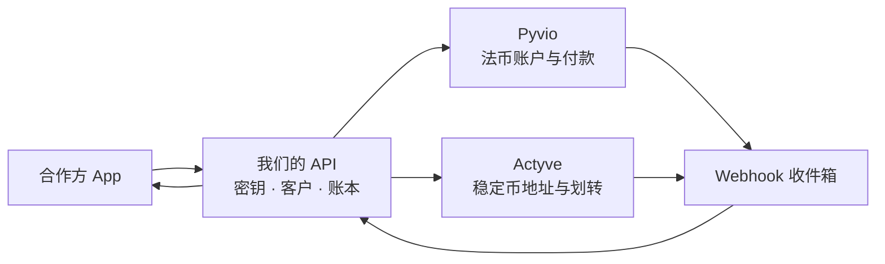

# 做成 API 平台：范围、成本和结构

> 评估日期：2026-09-20。数字是工程量估算，不是报价。通道费和牌照另计。

## 结论

不要第一期就做「完整的 BVNK」。我们是薄的一层：合作方只调我们，我们再调 Pyvio（法币）和 Actyve（稳定币）。

**1 名后端，大约 3 个月**，做出这条链路：开美元收款账户、拿 USDT 地址、查余额、入金通知、出金。虚拟卡、收银台、结汇、多国小币种后做。

写代码往往不是最贵的。如果客户资金要进我们自己的池子，牌照和律师可能贵得多。

## 结构

入金以 webhook 为准：验签、记入我们自己的账、再通知合作方。同一笔不能记两次。每天用两边流水对账。

私钥和银行清算都在通道那边，我们不托管。

## 三期

人力按 1 名后端。现金按税前约 3 万元/月粗算，不含服务器、通道费、律师、牌照。

| 阶段 | 做完能干什么 | 先不做 | 时间 | 工程现金 |
|------|----------------|--------|------|----------|
| 0 开门 | 沙箱、密钥、确认两家账户能否互转 | 业务代码 | 2–6 周，等对方 | 几乎为 0 |
| 1 能跑通 | 开户、法币账户、稳定币地址、余额、入金、出金 | 卡、收银台、结汇、小币种 | 10–14 周 | 约 9–12 万 |
| 2 能给人用 | 合作方密钥、通知重试、每日对账、简单运营页 | 白标 App | 再 6–8 周 | 再约 6–8 万 |
| 3 做全 | 换汇、结汇材料、虚拟卡、收单、更多链 | 自建清算和私钥 | 再 4–6 个月 | 再约 30–50 万 |

## 第一期 6 个能力

| 能力 | 合作方看到什么 | 背后 |
|------|----------------|------|
| 创建客户 | 提交资料，等审核 | Pyvio 开户 |
| 开法币账户 | 美元收款账号 | Pyvio 全球账户 |
| 开稳定币地址 | Tron 上的 USDT 地址 | Actyve |
| 查余额 | 法币和稳定币各多少 | 我们的账本 |
| 出金 | 到银行，或到链上地址 | Pyvio 付款或 Actyve 提现 |
| 通知 | 到账、成功或失败 | 我们转发已核对的 webhook |

## 阶段 0 必须问清

Actyve 出金类型里有 `GlobalAccount`。如果它就是 Pyvio 的全球账户，稳定币可以划进法币钱包，第一期是一条资金线。如果不是，第一期就是两条互不相通的余额，产品要分开讲。
