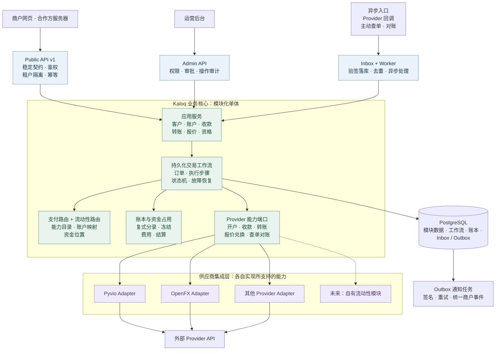
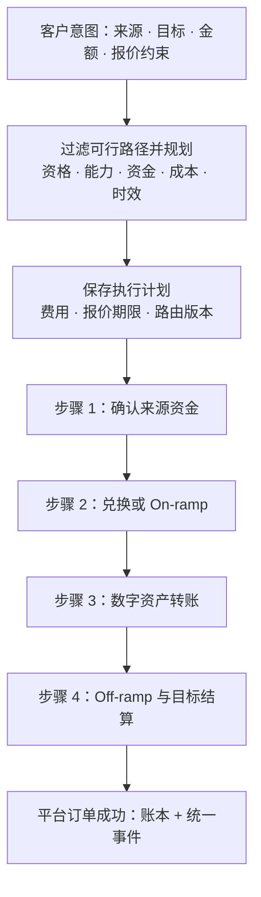
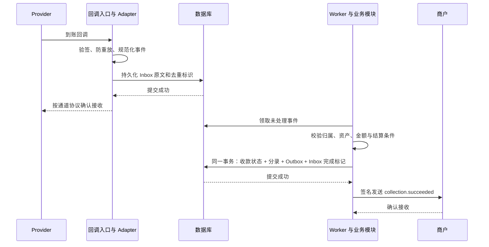

# Kaloq 程序架构：稳定 API 与可扩展 Provider

> **1.0 范围已收敛**：见 [1.0 最小需求与开发鸟瞰](v1.0-scope-and-plan.md)。本期仅 Pyvio，面向乌兹别克斯坦商户的 UZS 收款；每个 VA 关联 USDT 数字账户，四类划转均纳入第一期。KYC 和兑换由 Pyvio 完成，不独立接 Sumsub，不自建兑换或流动性池。本文保留通用扩展设计；涉及首期币种、Provider 和交付顺序时，以新基线为准。

> 架构提案 · 2026-10-05。依据根目录 `Kaloq_Business_Architecture.pdf` 两页，以及本次「网页 + 对外 API、法币收款、数字货币转账、多 Provider」需求。
> 仓库目前只有文档，以下是待实现的设计，不代表已经运行的系统或已验证的供应商能力。

## 1. 项目理解与设计结论

Kaloq 是支付与流动性聚合平台。客户通过网页或同一套业务 API，开通收款方式、查询资金、发起转账；平台负责开户编排、支付路径、兑换路径、执行跟踪、记账和通知。

PDF 还包含两条组合业务：A 的法币兑换数字资产；B 的法币经数字资产桥接，最终到达 C 的另一种法币账户。未来自有流动性池属于后续能力，不是当前资金路径的默认前提。

**建议采用「模块化单体 + 持久化异步 Worker + 按能力划分的 Provider 适配层」。对外契约归 Kaloq 所有，内部按端口与适配器模式隔离供应商。** 初期保持一个后端代码库和事务数据库，API 与 Worker 可以分别部署；业务复杂度增长后再按模块拆服务。

资料处理原则：

- PDF 中供应商是类型示例，其中写作 Paybio；用户和旧文档使用 Pyvio。本提案沿用 Pyvio 名称，不认定两者已核实为同一主体。
- 旧文档围绕 Pyvio + Actyve，部分段落默认自建钱包或自有库存。本提案不把这些选择当成已确认条件，也不认定 OpenFX、Yellow Card 支持某项具体接口。
- PDF 明确「路由不等同于托管」。本设计默认通过外部执行机构完成资金动作；若以后自托管，需要独立的钱包、签名、节点和资金管理系统，不能只补一个 Adapter 就算完成。
- 当前交付优先法币收款与数字资产转账。银行付款、兑换、数字货币桥的接口边界先预留，只有联调验证的能力才对商户开放。

## 2. 程序架构总图

总图导出：[PNG](diagrams/kaloq-program-architecture.png) · [SVG 矢量图](diagrams/kaloq-program-architecture.svg)。下方 Mermaid 为可编辑源。

箭头表示请求、调用或事件处理关系，不表示资金必然经过 Kaloq 自有账户。Provider 方框表示独立适配模块，不代表每家都支持全部能力。



数据库由模块接口共同使用，资金状态、账本与 Outbox 在同一事务中提交；图中仅从工作流画出存储关系。通知任务在事务提交后投递商户；回调链路详见第 7 节。密钥管理、加密文件存储、日志指标与告警为各层提供基础支持。

图中的连线是运行时调用。源码依赖方向另有约束：能力端口由核心定义，Adapter 实现端口并依赖核心类型；核心不得 import 任一供应商 SDK、请求类型或错误类型。由启动装配层注册具体实现。

网页与合作方共享 Public API 和应用服务。运营后台使用独立权限入口，但必须调用相同业务服务；审批、补查、重推通知不能绕过状态机和账本。若网页后来需要 BFF，它仅负责会话与页面数据组合，不另写资金逻辑。

## 3. 模块职责与不可越过的边界

| 模块 | 负责 | 边界 |
|---|---|---|
| Identity / Tenancy | 商户、用户、API Key、角色、环境、请求范围 | 每次对象访问验证 tenant；不能信任请求体自己声明的商户归属 |
| Customers / Eligibility | 客户主体、资料、按能力开通与补件 | 平台客户 ID 独立于供应商 ID；一家审核通过不代表全部通道通过 |
| Accounts / Collection Methods | 逻辑账户、银行收款信息、链上地址、账户映射 | 收款方式绑定 Provider 资源；银行账号和链上地址不是可随意迁移的字符串 |
| Collections | 到账识别、认款、待结算、到账确认与退回 | 主动入金可先于平台订单出现；识别不到归属时挂待认领，不猜测入账 |
| Transfers | 转账意图、目标、费用约束、业务状态 | 使用统一端点类型，不携带 Pyvio Unit、OpenFX 原始请求等 |
| Pricing / Quotes | 客户报价、费用、有效期、费率版本 | 区分客户价格与供应商成本；报价过期后不能静默换价执行 |
| Workflow / Routing | 分步骤执行、路由快照、恢复、人工异常处理 | 不把全部业务堆成一个通用 orchestrator；收款、转账、兑换各有工作流 |
| Ledger / Treasury | 不可变分录、占用、可用额度、资金位置与库存 | 只有该模块可记账；同币种分布在不同机构的钱不能假定随时可互用 |
| Provider Integrations | 鉴权、签名、字段/状态/错误映射、调用、回调解析 | 不决定客户价格，不直接写业务订单或账本，不通知商户 |
| Events / Notifications | Inbox、Outbox、商户事件、重试、重放 | 商户接收 Kaloq 事件，不能直接转发供应商原始回调 |
| Reconciliation / Operations | 流水与余额核对、差异单、异常审批 | 修复走受审计的业务指令和冲正分录，不能直接改数据库余额 |

## 4. 对外 API：围绕业务意图建模

以下是契约草案，尚未发布；路径中的 `v1` 表示未来第一版，不代表现在已有接口。API 中不要求传 `provider`，不暴露 `unit_id`、`rate_id` 等供应商参数。

| 对外资源 | 候选接口 | 稳定含义 |
|---|---|---|
| 客户 | `POST /v1/customers`、`GET /v1/customers/{id}` | 一个实名主体及平台状态 |
| 能力与补件 | `GET /v1/capabilities?customer_id=...`、`GET /v1/customers/{id}/requirements` | 对这个客户实际可用的币种、链、地区、额度及所需资料 |
| 账户 | `GET /v1/accounts`、`GET /v1/accounts/{id}/balance` | 平台逻辑账户及有明确可用范围的余额 |
| 收款方式 | `POST /v1/collection-methods`、`GET /v1/collection-methods/{id}` | 银行账号或链上收款地址 |
| 收款记录 | `GET /v1/collections`、`GET /v1/collections/{id}` | 已识别的外部入金及结算状态 |
| 转账 | `POST /v1/transfers`、`GET /v1/transfers/{id}` | 从一个来源向指定目标支付的业务订单 |
| 报价 | `POST /v1/quotes`、`GET /v1/quotes/{id}` | 对转账或兑换给出的金额、费用与有效期 |
| 事件 | `GET /v1/events`、`POST /v1/webhook-endpoints` | 可查询、可重放的统一业务事件 |

资料上传、补件提交等辅助接口需在 OpenAPI 细化阶段补齐。能力接口不是供应商菜单：它返回平台产品能力和客户资格；未开通的能力返回稳定的 `CAPABILITY_UNAVAILABLE`，不假装执行成功。

数字资产转账请求示意（ID 与金额均为虚构，`asset_usdt_tron` 是平台资产目录中的标识）：

```json
{
  "source_account_id": "acct_01",
  "source_amount": { "asset_id": "asset_usdt_tron", "value": "100.000000" },
  "destination": {
    "type": "blockchain_address",
    "asset_id": "asset_usdt_tron",
    "network": "tron",
    "address": "<已校验的目标地址>"
  },
  "fee_mode": "exclusive",
  "max_fee": { "asset_id": "asset_usdt_tron", "value": "2.000000" },
  "reference": "merchant-order-001"
}
```

- 变更请求带 `Idempotency-Key`；示例表示本金 100 USDT、手续费另扣且上限 2 USDT。实际应冻结本金和可确定的费用上限；如果费用资产不同，需分别报价、占用对应资产，不能隐式扣其他币。
- `destination` 是按 `type` 区分的结构化对象；银行付款使用 `bank_account`，受益人资料按平台 schema 定义。禁止用无限制 `provider_options` 包装原始供应商字段。
- 资产目录明确法币币种、代币网络和合约/发行信息。USDT Tron 与 USDT Ethereum 不因为代码相同就自动可互换；跨链是显式执行路径。
- 兑换或跨币种桥接先获取 `quote_id`，再创建关联它的 transfer；报价绑定客户、来源、目标、费用和时限，禁止替换目标或重复消费。
- 返回平台 `transfer_id`，异步受理返回 `202` 和查询地址。HTTP 受理只说明平台接单，不等于资金支付成功。
- 银行名、账户名、链、地址、必要交易凭证可以对外返回。供应商内部控制参数不成为客户必须理解的 API 字段；必要披露信息也不能为了「统一」而隐藏。

### 契约保持稳定的规则

1. 平台 ID、金额语义、状态、错误码、分页、幂等规则、事件格式由我们定义，用 OpenAPI / 事件 schema 固定下来。
2. 金额用十进制字符串，内部使用精确十进制或最小单位整数；精度来自资产目录，禁止浮点运算。时间用 UTC。
3. 错误分为输入无效、资格/能力不足、余额不足、暂不可用和处理结果未知等平台语义；HTTP 超时不直接映射为付款失败。
4. 兼容迭代增加可选字段或能力，不删除字段、不改含义、不增加原有操作的必填字段。新增枚举也需版本规则和 SDK 容错策略，不能默认安全。
5. 商户 Webhook 含 `event_id`、`schema_version`、`resource_version`、资源 ID、事件类型和时间；至少一次投递，商户按 event ID 去重，乱序时查资源最新状态。
6. **新增 Provider 实现已有能力时，现有客户端不改接口即可继续使用。真正的新产品语义可能需要新增资源或版本，不能承诺任何未来业务都无需演进契约。**

## 5. Provider 抽象：小接口 + 能力注册

不要做一个要求所有供应商实现所有方法的巨型 `PaymentProvider`。按独立能力定义核心端口，一个供应商可实现其中数项。

| 能力端口 | 典型操作 | 适配要求 |
|---|---|---|
| `CustomerOnboardingPort` | submit / getStatus / submitRequirements | 支持异步审核和动态补件，不假设都有子商户 |
| `CollectionMethodPort` | provision / get / disable | 区分长期账户、长期地址、订单地址及有效期 |
| `TransferPort` | submit / lookup | 明确可用支付轨道和是否支持幂等、按平台请求号查单 |
| `ConversionPort` | quote / execute / lookup | 明确报价是否可执行、失效时间、金额与费用语义 |
| `AccountBalancePort` | fetchBalances | 返回具体资金位置的余额，不直接覆盖平台余额 |
| `StatementPort` | fetchTransactions / fetchStatements | 支持游标、时间窗口和对账参考号 |
| `WebhookDecoderPort` | verify / decode | 验证原始字节，输出平台标准观察事件 |

内部调用接口概念示意（语言无关，不是技术栈选择）：

```text
TransferPort.submit(command, providerContext) ->
    Accepted(providerReference)
  | DefinitivelyRejected(reason)
  | OutcomeUnknown(correlationReference)

TransferPort.lookup(correlationReference, providerContext) ->
    ProviderObservation
```

`command` 使用平台资产、金额、来源、目标类型。`providerContext` 是内部的 Provider 实例、凭证引用、账户绑定；供应商原始字段在 Adapter 内部解析映射。`ProviderObservation` 只是外部观察结果，是否推进订单、入账由核心状态机裁决。

**能力注册不是写死「法币找 Pyvio，数字币找 Actyve」。** 每个 Provider 实例注册以下维度：

- 支持的动作、来源和目标资产、链、国家、银行轨道、金额范围和营业窗口。
- 对当前平台合同实际开通的能力，客户是否已开户、补件是否齐全、受益人是否可用。
- 当前资金位置、可动用余额/库存、预占、费用、预计时效和健康状态。
- 是否支持请求幂等、查单、取消、退款/退回、回调、结算报告；不支持的动作显式拒绝。
- 沙箱/生产、签约实体、地区账户和 credential reference；同一品牌可能对应多个互不共用资金的实例。

配置记录需要版本、审计和生效时间。配置声明不能替代沙箱/生产验证；新增能力只有验收后才能加入可路由集合。

## 6. 路由与多步骤交易

支付路由选择收款/付款执行轨道。流动性路由选择兑换和结算路径。二者合作生成内部 `ExecutionPlan`，对外仍然是一个业务订单。



该图展示数字货币桥；单纯链上转账只需要其适用步骤。Provider 如果提供原子化兑换出款，可以用一个组合能力步骤执行，不强行制造并不存在的独立中间账户。

每个步骤至少保存 `leg_id`、`provider_instance_id`、来源资金位置、输入输出资产与金额、平台请求号、供应商单号、状态、尝试记录和执行期限。订单保存路由与报价快照，运行中的订单不会随新配置自动换通道。

路由先判断可执行性，再比较成本与时效。**A 机构有 100 USD、B 机构有 0 USD，不能因为总余额是 100 就直接从 B 支付。** 换资金位置需要显式调拨步骤，或已有且获准使用的预存资金；路径中的手续费、链和结算时间都要计入。

报价方面：多步骤链路可能无法同时锁定所有报价。如果没有可兑现的端到端价格保障，就返回指示性报价并约定后续确认流程；不能用已过期的下游价格承诺目标实收。固定报价订单若下游失效，进入恢复/人工处理或使用平台事先批准的风险额度，不能让客户被静默加价。

### 重试、切换和失败恢复

| 情况 | 处理 |
|---|---|
| 尚未向 Provider 发起有副作用的调用 | 可以重新规划，但仍需满足报价、授权与资金约束 |
| Provider 明确拒绝且确认没有任何资金动作 | 根据错误类别选择重试、改路由或结束 |
| 请求超时、断网或 Worker 在提交后崩溃 | 步骤标记结果未知；保留资金占用，先按请求号查单，不能盲目换 Provider |
| Provider 支持可靠幂等 | 可按该协议用同一个步骤请求号恢复提交；不生成新的付款号 |
| Provider 不支持幂等且查不到确定结果 | 等待回调、结算报告或人工确认；不自动再出款 |
| 前一步已兑换，后一步失败 | 保留实际资产及资金位置，订单进入恢复/人工处理；不能把原币余额直接解冻当作未执行 |
| 银行退回、撤销或链上重组 | 按规则创建关联退回/冲正记录和补偿事件；保留原始成功事实及后续更正轨迹 |

这类交易使用可持久化的 Saga：每一步是独立外部动作，恢复不等于数据库回滚。链上已确认交易没有通用「撤销」操作；反向转账/换汇是新的资金动作，也可能失败或产生损失。

## 7. 账本、异步一致性与对账

### 关键数据模型

| 实体 | 用途 |
|---|---|
| `Tenant / Customer / CapabilityGrant` | 商户归属、客户主体、按能力授予的资格 |
| `Account / CollectionMethod` | 平台逻辑账户和收款信息；账户不是供应商钱包的别名 |
| `ProviderInstance / ProviderBinding` | 同品牌不同签约实例；客户、账户、地址、受益人、外部 ID 的映射 |
| `FundingPosition / Reservation` | 某机构、主体、资产、链及隔离账户里的资金与占用 |
| `Quote / Transfer / ExecutionPlan / Leg / Attempt` | 客户报价、业务单、执行路径、逐步尝试及恢复信息 |
| `Collection / Return / Adjustment` | 主动到账、待认领、退回、更正与原交易关联 |
| `Journal / Posting` | 按资产平衡的复式分录；只追加，用冲正修正 |
| `Inbox / Outbox / Delivery` | 通道原始观察、业务事件、各订阅地址的投递记录 |
| `ReconciliationCase / AuditLog` | 对账差异及运营操作依据 |

共享 PostgreSQL 不等于共享任意表写权限：各模块拥有自己的表和写入接口。需要原子提交的订单、资金占用、账本和 Outbox 由应用事务协调，其他模块通过接口调用，不直接修改它们。

平台账本记录已确认的业务资金事实。若资金在客户名下独立账户，采用适合该模式的运营分户账；若资金在平台汇总账户，记录客户应付、托管资产、费用和库存。具体科目依据实际资金权属定稿，不能因图上有「钱包」就默认平台持有客户资金。

余额区分 `pending / available / reserved`，并受资金位置、链、结算、资格和出款范围限制。Provider 余额用于核对与执行资格判断，不能覆盖内部账本，也不能将它与平台记账余额相加。平台外发生的资金动作需通过同步和对账补齐；出现重大差异时暂停受影响位置的新出款。

### 收款处理



通道回调只是证据来源之一，查单和结算流水同样产生标准观察事件。Webhook 延迟、丢失或乱序不能决定钱是否存在。原始报文按敏感等级加密、脱敏和设置保留期；验签失败不进入业务 Inbox。

### 转账处理

1. 检查商户权限、客户能力、目标、报价、可用资金及资金位置。
2. 在一个数据库事务中创建订单/执行步骤、建立幂等记录、占用余额与资金位置、写待执行 Outbox。并发扣款采用锁或条件更新，禁止先查余额再无条件扣减。
3. 提交事务后由 Worker 调 Provider；不要在数据库事务里等待外部 HTTP。同步响应、回调、查单均走同一状态推进逻辑。
4. 明确成功后结算占用并记账；明确未动款失败后释放占用；结果未知保持占用并查明。
5. 状态、账本、出站事件在同一事务中提交。HTTP 响应丢失时，调用方以同一幂等键查询/重试，获得原订单。

幂等键范围为 `环境 + tenant + 操作 + key`，保存请求摘要；同键不同参数返回冲突。它不同于客户可读的 `reference`。Provider 步骤请求号应长期保留，即使 HTTP 幂等缓存过期，也不能让同一执行步骤重新付款。

Inbox 去重按 Provider 实例及稳定事件标识；业务入账再按外部交易与记账动作设置唯一约束，防止不同事件 ID 描述同一到账。链上交易不能只用 tx hash 去重，还需网络、资产、事件/输出索引等。工作任务通过租约/锁与版本控制并发领取。

系统采用至少一次处理加业务幂等，不宣称跨数据库、Provider、区块链实现分布式 exactly-once。

对账分两类：短周期查单处理悬挂交易；按通道结算周期核对订单、流水、余额、费用及资产位置。未知入金进待认领记录；银行入金待结算和链上确认数不足时只记待处理状态。成功后的退回/冲正不能被「终态回调全部忽略」规则吞掉。

## 8. 新增 Provider 时具体改哪里

假设未来新增供应商支持**已有的链上转账能力**：

1. 在 `integrations/providers/<name>/` 实现所需端口及标准请求、结果、错误、回调映射。
2. 注册 Provider 实例、凭证引用、已验证能力和路由约束；补齐客户、资金位置与受益人绑定。
3. 运行同一套端口契约测试：提交成功、明确拒绝、超时未知、幂等、重复/乱序回调、查单、费用及对账。
4. 增加新 Provider 的沙箱联调测试，验证实际资金路径与权限，而不只验证 HTTP 200。
5. 通过配置按商户/地区/限额灰度启用，监控成功率、悬挂订单和对账差异。

**无需修改：** 已发布的 transfer 请求/响应结构、平台 ID、商户 Webhook schema、网页资金操作流程、已有 Provider 实现。已有客户端的契约回归测试必须继续通过。

**可能需要新增：** 该供应商专有的客户补件要求、账户开通流程或一种全新的业务能力。这些应通过通用 requirements 机制或新增独立产品能力表达，不能要求全部客户增加供应商必填字段。现有客户无法满足新通道资格时，保持原通道，不能强行路由过去。

新 Provider 的部署不迁移已有银行账号和地址。收款方式继续绑定原 Provider；历史订单仍向原 Provider 查单，原回调也继续处理。账号迁移、换发收款信息和存量资金转移需要单独流程。

## 9. 建议代码目录与部署方式

目录与具体语言无关，待团队选型后落地：

```text
apps/
  merchant-web/             商户网页
  operations-web/           运营后台
  api/                      公共 API、Admin API、Provider 回调入口
  worker/                   工作流、Inbox、Outbox、查单与对账任务
contracts/
  public-api/v1/            OpenAPI、统一 schema、错误码
  events/v1/                商户事件契约
modules/
  identity/  customers/  accounts/  collections/
  transfers/ quotes/ routing/ workflows/
  ledger/ treasury/ notifications/ reconciliation/
ports/providers/            核心拥有的能力接口与标准 DTO
integrations/providers/
  pyvio/
  openfx/
  ...
infrastructure/
  persistence/ jobs/ secrets/ observability/
tests/
  architecture/             模块依赖与边界检查
  contract/                 公共 API 兼容性、Provider 契约
  integration/              沙箱、回调及数据库事务验证
```

一期部署可以采用 API + Worker + 托管 PostgreSQL，网页独立发布；这两个进程共享代码模块，通过数据库持久化协调。Inbox / Outbox 和任务队列先用数据库实现，不强制引入 Kafka、Redis、Kubernetes 或独立微服务。

生产部署仍需备份恢复、进程监控、任务租约、失败队列和告警。API、回调、Worker 可以逐步独立扩容；Provider 请求按对方要求经过固定出口。密钥交由密钥管理服务，KYC 文件独立加密存储，日志隐藏敏感信息；商户通知地址校验并限制内网访问，避免通知功能成为 SSRF 入口。

未来自有流动性池可通过相同报价/执行端口参与路由，但背后必须建设库存、预占、限额、敞口、结算及必要托管系统。端口能保持业务契约稳定，并不能省掉这些内部能力。

## 10. 开始编码前需要确认的业务事实

这些问题不妨碍当前抽象成立，但决定哪些能力可以启用：

| 待确认 | 影响 |
|---|---|
| 首期国家、资产、网络、法币收款轨道 | 能力注册、金额精度、受益人资料、路由范围 |
| 客户独立账户或平台汇总账户；谁控制资产与私钥 | 账户映射、账本科目、资金占用与库存模型 |
| 各 Provider 的实际合同、机构模式、独立地址与 KYC 要求 | 可开通能力、补件流程、收款归属识别 |
| 是否能按平台请求号幂等提交与查单；最终结算和退回语义 | 自动恢复边界及人工处理机制 |
| PDF 数字货币桥的两端能否真正连通，报价是否可锁定 | 是否能提供可执行的端到端报价与资金路径 |
| 数字货币转账的资金来源：既有托管余额、外部入金或兑换所得 | 首期入金/账户功能依赖及付款前置条件 |
| 法币与数字资产的费用承担方式、授权上限与退款规则 | 报价、资金占用、账本与客户端金额语义 |

建议落地顺序：先定平台 OpenAPI 与事件契约；再用 Fake Provider 实现资金状态机、账本和异常恢复；之后按相同端口接首家真实 Provider，并用第二家或测试实现验证可替换性。首期产品先贯通法币收款与数字资产转账，再启用已验证的兑换和多步骤桥接。
