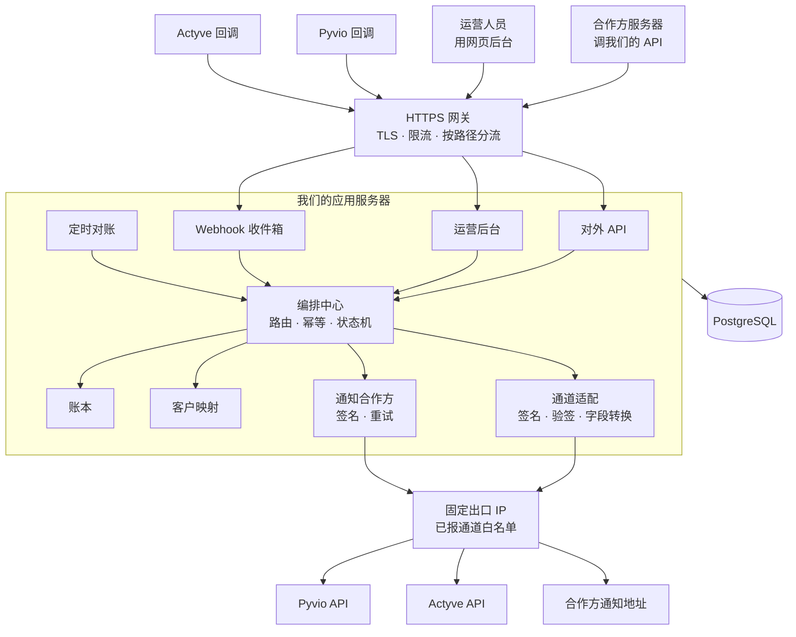
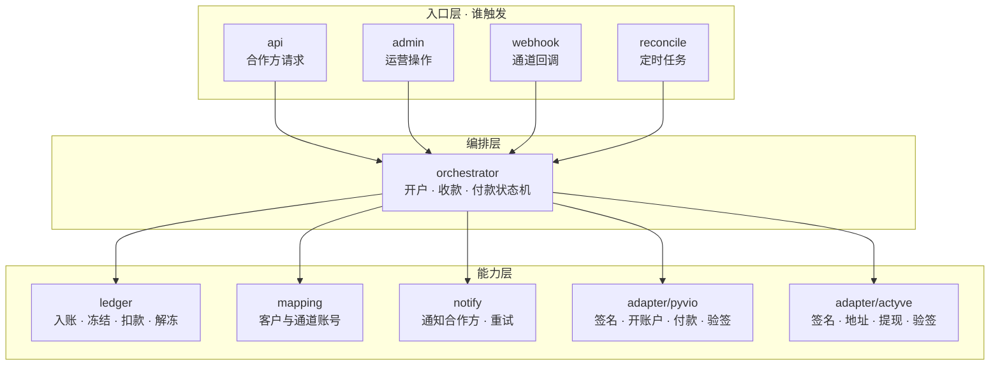
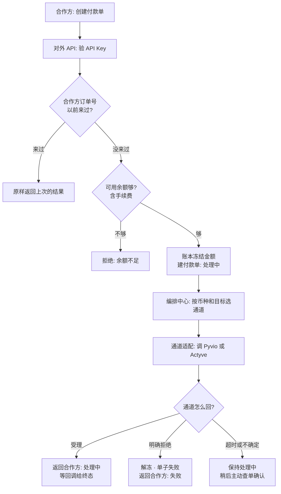
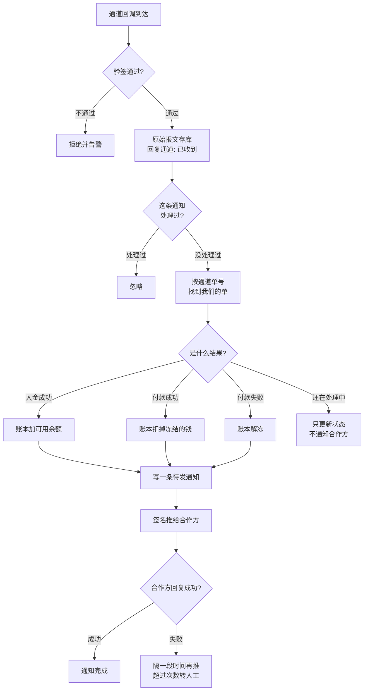
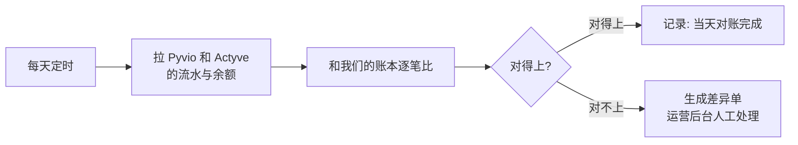
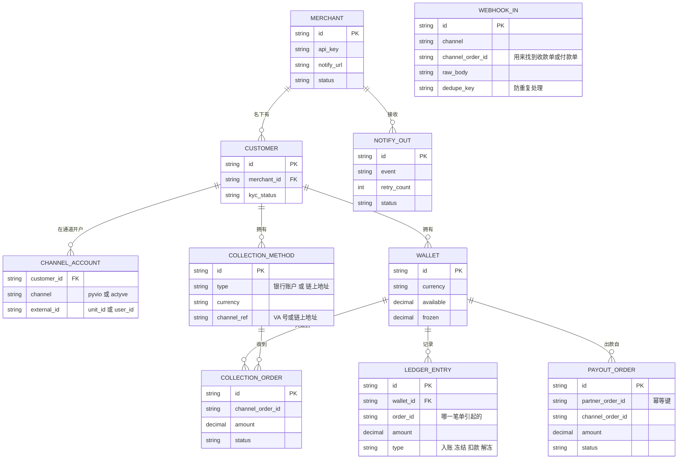
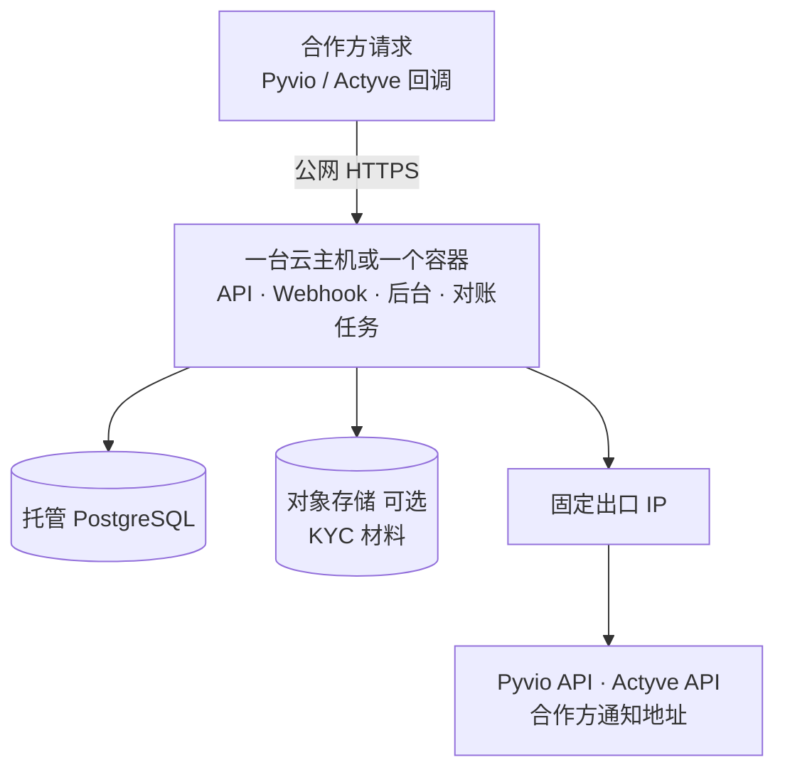
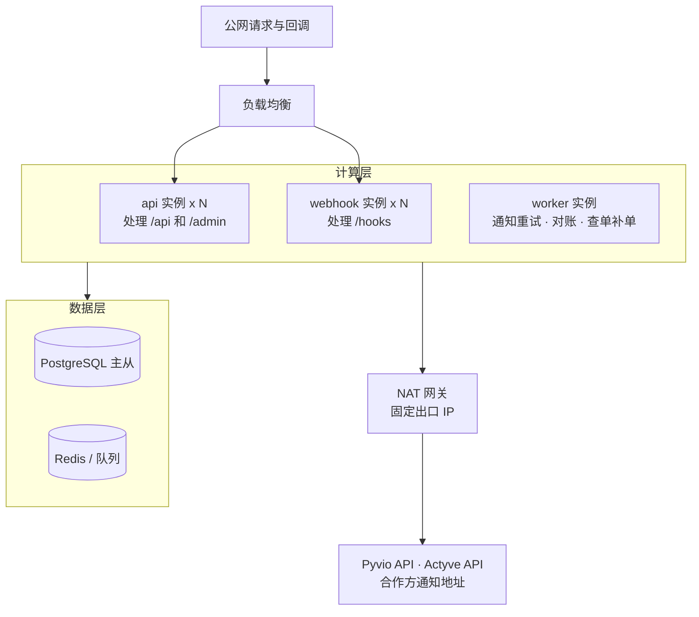

# 服务器架构 · 我们这层怎么部署、怎么调度

> 对应产品需求：[aggregation-requirements.md](aggregation-requirements.md)  
> 本文只画 **我们自己的服务器**。银行清算和链上确认在 Pyvio / Actyve 里，不画进我们机房。  
> 图用 Mermaid 线框语法。每张图只画一个方向，不画回头的箭头，否则渲染会出空白。

---

## 1. 一句话

我们要跑一套 **聚合后端**：对外给合作方 API，对内调 Pyvio 和 Actyve，中间有自己的账本、映射表和 webhook 处理。再挂一个简单的运营后台给内部人用。

第一期可以全挤在 **一台应用 + 一个数据库** 上；逻辑上仍按下面模块拆开，方便以后拆服务。

---

## 2. 总览

外面进来的请求在上面，我们往外发的请求在下面。Pyvio / Actyve 画了两次：一次是「回调我们」，一次是「被我们调用」，这是两个方向，不是两套系统。

所有模块都读写同一个 PostgreSQL，图里用一根线表示。Webhook 收件箱收到回调后第一件事就是把原文存库，再交给编排中心。查余额也经过编排中心，由它去读账本。

| 块 | 干什么 |
|----|--------|
| HTTPS 网关 | 证书、限流，按路径把请求分到对外 API、运营后台、Webhook 收件箱 |
| 对外 API | 合作方唯一入口：客户、收款方式、余额、付款、查单 |
| 运营后台 | 内部查单、看对账差异、手动补单或重推通知（手动操作也走编排中心） |
| Webhook 收件箱 | 收 Pyvio / Actyve 的通知：验签、先存库、再交给编排中心 |
| 编排中心 | 选通道、推进订单状态、保证同一笔只处理一次 |
| 账本 | 对外展示的余额和流水，只有这里能改余额 |
| 客户映射 | 我们的客户 ID 对应 Pyvio 的 Unit、Actyve 的地址 |
| 通道适配 | 两家各一套签名和字段，在这里翻译成我们的统一格式 |
| 通知合作方 | 把我们的统一事件签名后推给合作方，失败就重试 |
| 定时对账 | 拉两边流水，和我们的账本逐笔比 |
| 固定出口 IP | 两家都要 IP 白名单，所有往外的请求都从这个 IP 出去 |
| PostgreSQL | 商户、客户、钱包、订单、通知、对账记录 |

Redis 第一期可以不要。限流、锁、任务队列先用数据库做，流水大了再加。

---

## 3. 应用内部：逻辑模块（可以同进程）

第一期不必拆成很多微服务。一个后端进程里按模块分开即可。

分三层：上面是「谁触发」，中间是编排，下面是具体能力。上层只调编排，编排再调下层，层之间不跳着调。

webhook 验签用的是两个 adapter 里的验签函数，属于「借用工具」，不算跳层，图里不单独画。

原则：

- **合作方永远只碰 `api`**  
- **通道细节关在两个 `adapter` 里**，别散落到业务代码中  
- **余额只改 `ledger`**，入金、付款成功、付款失败都走账本，不直接改展示数字

---

## 4. 三条主链路

### 4.1 合作方发起付款（我们调通道）

付款前必须先冻结余额，否则两笔付款同时进来会把钱付超。通道超时不能当失败处理，否则可能重复付款。

开户、开通收款方式也是同样的套路：先建我们的单，调通道，终态以回调或查单为准。

### 4.2 通道回调（钱到了 / 付完了）

Pyvio 的入金可能先是 `Pending`（钱在待结算账户），这时不能加可用余额，要等 `Success`。终态之后再来的通知一律不改状态。

### 4.3 每日对账

处理中太久的付款单，也由这个定时任务主动去通道查一次，补上漏掉的回调。

---

## 5. 数据要存什么（库表概念）

不要求第一期表名定死，但概念上至少有这些：

| 概念 | 存什么 |
|------|--------|
| 商户 | API Key、通知地址、状态 |
| 客户 | 我们的客户 ID、属于哪个商户、KYC 状态 |
| 通道账号 | 一行一个通道：Pyvio 的 unit_id，或 Actyve 的 user_id |
| 收款方式 | 银行账号或链上地址，以及它在通道里的编号 |
| 钱包 | 客户 + 币种，分可用和冻结两个数 |
| 账本流水 | 每一笔加减，只追加不修改，并记下是哪一笔单引起的 |
| 收款单 | 每笔入金一条，对应通道的入账单号 |
| 付款单 | 我们的单号、合作方单号（幂等键）、通道单号、状态 |
| 回调原始包 | 两家发来的原文，用来防重复和事后对账。一条回调只对应一张单（收款单或付款单），靠通道单号找到，所以图里不画连线 |
| 通知出站记录 | 推给合作方的事件、是否成功、重试了几次 |

---

## 6. 部署形态（由简到繁）

### 6.1 第一期（推荐起点）

- 出口 IP **固定**，报给 Pyvio / Actyve 做白名单  
- Webhook 地址必须是公网 HTTPS  
- 密钥、RSA 私钥放环境变量或密钥管理服务，不进代码库  

### 6.2 流水上来以后再拆

机器变多以后，每台的出口 IP 会不一样，所以必须加一个 NAT 网关，让所有往外的请求共用一个固定 IP。

计算层的三类实例都读写数据层；负载均衡不会把流量发给 worker，它只跑后台任务。

Webhook 和对外 API **分开扩**，避免通道回调把合作方的接口挤满。

---

## 7. 安全与边界（架构约束）

| 规则 | 原因 |
|------|------|
| 合作方不能直连 Pyvio / Actyve | 否则没有聚合，也没法统一记账 |
| 付款前先冻结余额 | 防止同时来两笔把钱付超 |
| 通道超时不算失败 | 通道可能其实已经付出去了，直接重试会付两次 |
| 出站请求带我们的 RSA 签名 | 两家文档都要求 |
| 入站回调先验签、先存库 | 防伪造到账，也防重复入账 |
| 我们通知合作方也要签名 | 合作方才能相信通知是我们发的 |
| 私钥不出应用环境 | 泄露等于别人能替我们出款 |
| 账本和通道每天对账 | 发现漏单和重复入账 |

---

## 8. 和「运营后台」的关系

- **必须有**：调度两家 API 的 **后端服务**（上面整张图）  
- **强烈建议有**：给内部看的 **运营后台**（登录、订单列表、对账差异、手动补单）  
- **不是第一期重点**：给合作方用的商户门户（他们用自己的 App 调 API 即可）

没有后端，聚合不成立。没有运营后台，出问题只能查日志，但系统仍能跑。

---

## 文档版本

- **v0.3**：复查修正。补上付款前冻结、通道超时处理、回调防重、对账链路；总览补上通知出站和固定出口；模块图改成三层；去掉会撑出空白的回头箭头和交叉线；数据图补收款单和回调原文；8 张图均已实际渲染检查
- **v0.2**：总览、模块、主链路、数据、部署全部改为 Mermaid 线框
- **v0.1**：画出聚合服务器总览、模块、主链路、第一期部署与数据概念
