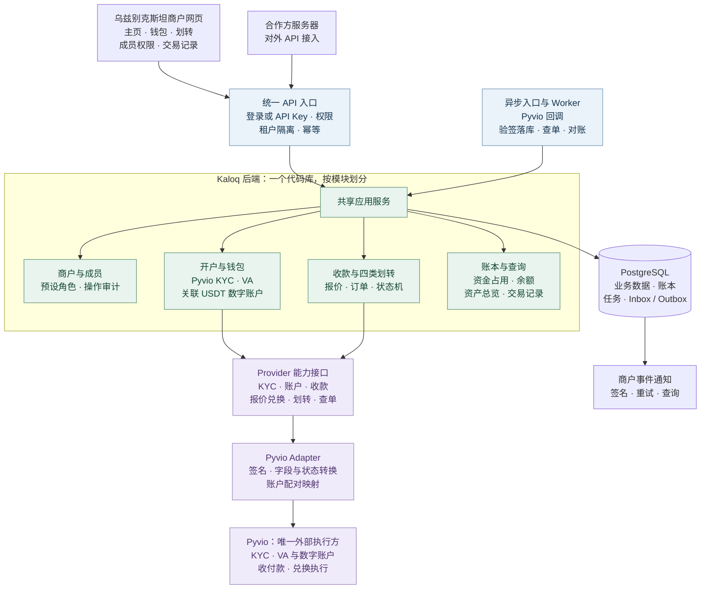

# Kaloq 1.0：最小需求、程序架构与开发鸟瞰

> 更新：2026-10-05。依据本次用户确认的第一期范围建立需求基线。本文是 **1.0 范围的唯一入口**；旧文档中的 USD 起步、Pyvio + Actyve、自建钱包、兑换放二期等安排不再作为本期依据。
> 当前为需求与设计阶段，尚无业务程序。需求列入 1.0 不表示外部通道能力已验证。

## 1. 已确定的版本边界

| 项目 | 1.0 决定 |
|---|---|
| 首个商户 | 一家乌兹别克斯坦企业；以企业商户自用资金工作台为当前设计口径 |
| 收款 | 支持乌兹别克斯坦苏姆 **UZS** 收款；具体收款轨道和账户形式待 Pyvio 联调确认 |
| 钱包 | 从第一版就有 **法币钱包 + 数字资产钱包**；按用户与 Pyvio 沟通的模式，**每个 VA 对应一个数字账户** |
| 数字资产 | 暂定 **USDT**；若开放链上收付，网络跟随 Pyvio 实际开通配置，不默认 Tron |
| 兑换执行 | 法币与数字资产的兑换 **全部由 Pyvio 完成**；平台不自行做兑换、撮合或提供库存 |
| 页面 | 主页、钱包、划转、Settings 成员权限、记录/交易明细 |
| 划转 | **法转法、法转数、数转数、数转法均属于 1.0** |
| 支付 Provider | **只接 Pyvio**；不接 OpenFX、Actyve 等第二家，不自建私钥托管或流动性池 |
| 身份认证 | **KYC 使用 Pyvio**；按最新澄清，1.0 不单独直连 Sumsub / Sumsub ID |
| 接入方式 | 商户网页 + 稳定对外 API；同一套业务服务处理资金逻辑 |
| 权限 | 一个商户下有多个成员，使用预设角色；后端执行权限校验 |
| 扩展约束 | 首期固定路由 Pyvio，仍保留能力接口和独立 Adapter；不提前建设多 Provider 比价引擎 |

当前不默认增加商户下游个人客户开户体系。所有成员使用本商户的账户，成员不各自拥有一套资金钱包。若后续确认商户还要为其终端用户开独立账户，再扩展客户层级；数据库保留 `tenant_id`，不把首家商户写死在代码中。

本次追加澄清已经纳入：USDT、VA 与数字账户配对、Pyvio 内完成兑换、Pyvio KYC。用户提供的通道模式作为设计输入；账户编号、配对关系、报价和状态字段在联调时落实。若 Pyvio 内部使用 Sumsub，该实现细节封装在 Pyvio 流程内，不增加我们直连 Sumsub 的开发任务。

## 2. 页面与可验收的功能清单

| 编号 | 页面 / 功能 | 要做什么 | 第一版验收结果 |
|---|---|---|---|
| H01 | 主页：余额 | 分资产展示可用、处理中/待结算、冻结余额；区分法币和数字资产 | 余额与钱包和交易明细一致，未开通不伪装成可用账户 |
| H02 | 主页：资产总览 | 展示两类资产分布；建议以 UZS 作总览估值单位，显示估值时间 | 各币种不能直接相加；无汇率资产标记未计入，总览不等于可划转余额 |
| H03 | 主页：交易记录 shortcut | 最近交易列表、单笔详情入口、全部记录入口 | 点击能直达对应详情或记录页 |
| W01 | 钱包：未开户 | 展示法币/数字钱包占位与开通入口，引导资料提交和 KYC/KYB | 清晰显示未提交、审核中、需补件、拒绝、开通中等状态 |
| W02 | 钱包：身份认证 | 接入 Pyvio KYC，提交资料或打开 Pyvio 认证流程，接收审核结果并支持补件 | 刷新/重登能恢复进度；前端成功提示不能直接将认证判为通过 |
| W03 | 钱包：已开户 | 法币账户与 **VA 列表/详情**，展示币种、银行/账号、收款说明、状态 | 只展示 Provider 实际开出的收款信息；VA 是收款入口，不单独重复计余额 |
| W04 | 钱包：数字资产 | 展示每个 VA 关联的 USDT 数字账户、余额和状态；若开通链上收付，再展示网络/地址等 | 配对关系正确；数字账户 ID 不等同于链上地址，不重复开户或生成地址 |
| T01 | 划转：法转法 | 选择来源、法币目标、金额；同币种转账或已开放的跨币种兑换；确认费用后提交 | 账户、报价、权限、余额均校验；正确扣账或恢复占用 |
| T02 | 划转：法转数 | 法币余额换成数字资产；选择支持的资产/网络、目标、金额 | 显示付款、收款、汇率、费用及期限；完成后两端记录一致 |
| T03 | 划转：数转数 | 先实现已确认资产与网络的数字资产划转；源/目标为支持的平台账户或链上目标 | 链、地址、金额及费用校验；重复提交不重复付款 |
| T04 | 划转：数转法 | 数字资产兑回法币，到支持的法币账户/银行目标 | 显示到账币种、金额、费用和状态，确认目标结算后才成功 |
| S01 | Settings：成员 | 初始管理员由运营开通；邀请、查看、停用成员，处理邀请过期 | 被停用成员无法继续操作；不能停用最后一个有效管理员 |
| S02 | Settings：角色 | 为成员选择管理员、资金操作员、只读成员等固定角色 | 菜单和后端授权一致；只读角色调用资金 API 也被拒绝 |
| R01 | 记录：交易明细 | 列表、分页、时间/类型/状态/资产筛选、单号查询与详情 | 覆盖收款与四类划转；显示金额、费用、汇率、时间、状态和执行人 |

界面结构：

```text
商户工作台
├─ 主页：余额 / 资产总览 / 最近交易与记录 shortcut
├─ 钱包
│  ├─ 法币钱包：开户进度 / KYC-KYB / VA 列表与详情 / 余额
│  └─ 数字钱包：关联 VA / USDT 账户 / 余额 / 网络与收款信息（若开通）
├─ 划转：法转法 / 法转数 / 数转数 / 数转法
├─ 记录：交易列表 / 筛选 / 单笔详情
└─ Settings：成员 / 角色选择
```

四类划转指四个资金方向，**不等于任意币种、任意链、任意收款人均可用**。币种对、网络、目标类型按确认的能力配置。跨链、不同代币互换、外部第三方银行付款不默认全开，但必须在正式验收前明确每个方向的具体来源与目标。

默认最简交互为「选择来源与目标 → 输入金额 → 预览到账和费用 → 确认 → 查看进度」。兑换/费用变动导致报价过期时重新确认，不静默修改用户确认的金额。站内余额转换与实际对外汇款必须在页面上明确区分。

## 3. 基础第一版架构图

导出：[PNG](diagrams/kaloq-v1-architecture.png) · [SVG](diagrams/kaloq-v1-architecture.svg)。以下 Mermaid 是可编辑源。



图中是逻辑模块，不是每个方框一台服务器。第一版建议只部署 **商户 Web + API 进程 + Worker 进程 + 托管 PostgreSQL**，API 和 Worker 复用同一份后端代码。加密文件存储、密钥管理、监控、备份作为基础设施配置。

应用服务通过模块接口协调操作，订单、余额占用、账本和 Outbox 一起提交事务。资金任务提交后由 Worker 调用 Provider；回调、查单和对账统一进入业务状态机。存储连线为简图，并非所有模块都能直接修改所有表。

当前只有 Pyvio 实现 Provider 能力接口，按配置固定选择它；KYC、开户、收付款和兑换都经这一 Adapter。核心仍按能力定义小接口，避免写成一个巨型接口；后续新增 Provider 时注册新 Adapter，不要求客户端增加供应商参数。

## 4. 开户和双钱包的最小模型

**一商户、多成员、VA 与 USDT 数字账户配对。** 首次登录就能看到两类钱包入口；Pyvio 完成开户后同步 VA 和对应数字账户。两端状态分别保存，避免只有 VA 已返回、数字账户仍待创建时错误显示全部可用。

按以下层级保存数据：

```text
商户 tenant
├─ 成员 memberships → 角色与权限
├─ 企业主体 legal_entity → Pyvio KYC 认证记录
└─ 账户组 account_group（可有多组）
   ├─ 法币逻辑账户 → UZS 等已开币种 → VA
   └─ 配对数字逻辑账户 → USDT → Pyvio digital_account_id
```

内部保存 `tenant_id / account_group_id / fiat_account_id / collection_method_id / digital_account_id`，通过 ProviderBinding 映射 Pyvio 的 VA、数字账户和实际余额账户编号。当前 Pyvio 的 VA 与数字账户对应关系必须可追溯；该关系只写在内部映射，不强制未来所有 Provider 采用同样结构。

VA 列表与钱包余额分离：首页按实际余额账户去重汇总，不按 VA 行数累加。数字账户是 Pyvio 内部账户，不必然等于链上地址；若该账户提供多个网络出入金，网络属于执行路径，只有实际分隔的余额才拆分账本资产位置。后续链上收付时，记录资产发行/合约与网络，不能仅凭 `USDT` 名称判断网络通用。

分别维护三种状态，避免一个 `kyc_passed` 包办全部：

| 状态对象 | 示例状态 | 决定什么 |
|---|---|---|
| 身份认证 | 未提交、审核中、补件、通过、拒绝 | Pyvio KYC 资料核验是否完成 |
| Provider 开户 | 未申请、申请中、通过、拒绝、受限 | Pyvio 是否接受并建立账户 |
| 钱包/能力开通 | 待开通、开通中、可用、受限 | UZS 收款、某数字资产划转是否能实际使用 |

公司商户的开户资料按企业主体设计，可能涉及企业 KYB 及代表人/受益人的 KYC，具体材料以开通流程要求为准。成员登录身份、公司认证主体和收付款账户不是同一个对象。

Pyvio KYC 接入任务包括：资料提交或认证跳转、主体 ID 映射、审核状态查询、回调验签、补件、开户进度恢复。具体使用 API 表单还是 Pyvio 托管页面，在拿到接入方式后确定。认证结果、VA 开通、数字账户就绪分别确认，再开放对应收付款能力。

### KYC 资料留存与复用（Pyvio API 分析，2026-10-08）

**结论：可以在我方保留一份已提交资料，并为后续开户/补件提供一键预填或受控重提；最有价值的复用方式，是同一 Pyvio `client_id` 下创建多个 Unit。** 这不等于可把资料无条件、无感知地提交给任意新 Provider 或用于任何新主体。Pyvio 的 Create User 文档明确把 `client_id` 标为“同一 KYC 创建多个 Unit”时需要的字段；创建成功后返回 `unit_id`、`client_id` 和开户状态。其用户查询接口主要返回这些标识与状态，不能代替我方保存提交时的完整资料快照。[Pyvio User v2 API](https://developer-doc.pyvio.com/v2/User/)

Pyvio 的公开文件流程是先把原文件上传到 Pyvio SFTP，再调用 File Upload API 换取 `file_id`，之后业务接口引用该 ID。公开文档说明了上传步骤和按 `unit_id` 组织的文件路径，但没有给出从 `file_id` 取回原文件的流程。因此我方应保留用户授权提交的原始附件和每次提交的字段快照，不能把 Pyvio 的 `file_id` 当作唯一备份。需要创建新 Unit 或更新材料时，预期要按 Pyvio 要求重新上传并获取适用的 `file_id`；这点及文件 ID 有效期需在沙盒确认。[Pyvio File Upload API](https://developer-doc.pyvio.com/v1/File/)

按 Pyvio 文档的开户状态处理：

| Pyvio 状态 / 情形 | 平台处理 |
|---|---|
| `Pending` | 保持审核中，等待 User Notification 或查单同步结果；不重复创建。 |
| `Active`，同一已认证主体再开 Unit | 用已映射的 `client_id` 创建新 Unit，先校验业务类型、国家及产品范围是否适用；这是优先验证的 KYC 复用路径。 |
| `Returned` | 更新原 `unit_id`（或 `partner_user_id`）并提交要求的补充字段/`extra_document`，继续跟踪该 Unit；不要另建新用户绕过补件。 |
| `PreOverdue` | 视为证件临近到期的更新任务，提示客户确认现期资料并按 Pyvio 要求更新。 |
| `Suspend` / `Deact` | 暂停自动开户，转人工联系 Pyvio；公开流程说明受限主体不能简单重新创建。 |
| 新法人主体、关键受益人/董事变化、证件过期或 Pyvio 新增要求 | 重新收集或确认相关资料，再按 Pyvio 指示更新/重新认证，不复用过期或不匹配的数据。 |

上述状态与补件路径来自 [Pyvio onboarding flow](https://docs.pyvio.com/pages/guid/flow/)；Update User 可按 `unit_id` 或 `partner_user_id` 更新主体信息并附加要求文件，字段和文件要求以当前接入版本为准。[Pyvio User v2 API](https://developer-doc.pyvio.com/v2/User/)

“一键”可以实现为用户确认后的资料预填和提交；“无感知”建议限制为已明确授权、资料仍有效且没有实质变化、提交对象与用途均在授权范围内的自动重提。字段变化、证件更新、受益人变化或新的材料要求出现时，应要求用户确认/补交。每次发送前生成不可变的提交版本，记录字段来源、附件哈希、授权时间、目标 Pyvio 主体/Unit、请求号及结果，避免后台悄悄使用旧资料。

我方留存应采用加密对象存储和密钥管理，按商户及主体做访问隔离；敏感字段和附件不写入应用日志，限定管理权限并记录查看/导出/提交审计。保存用途、授权与保留期限，提供撤回/删除流程，并跟踪已提交给 Provider 的副本如何处理。只保留开户和后续复用确实需要的字段与文件。

开发验收前需让 Pyvio 在沙盒确认：已有 `client_id` 可复用的主体范围及是否触发新 KYC 审核；乌兹别克斯坦商户当前产品/Unit 是否支持该模式；`Returned`、`PreOverdue` 的精确更新规则和必传字段；跨 Unit 重传文件、`file_id` 有效期及文件删除/保留方式。API 层使用我方稳定的主体、认证记录和开户资源，不把 Pyvio 的 `client_id` 暴露成客户必须管理的概念；使用稳定 `partner_user_id` 和幂等请求保护重试，防止重复开户。

## 5. 四类划转共用一套交易核心

四个页面入口不做成四套账本或四组供应商透传接口。统一使用 `Quote → Transfer → ExecutionStep → Ledger → Event`：

| 方向 | 第一版业务动作 | 主要技术工作 | 通道验收条件 |
|---|---|---|---|
| 法 → 法 | 法币同币种划转 / 已开币种间兑换 | 来源与目标校验、换汇报价、执行、余额变动 | Pyvio 实际支持的 UZS 币种对和目标账户 |
| 法 → 数 | 法币在 Pyvio 内兑换为 USDT | 调 Pyvio 报价与执行，来源占用、结果确认、双边记账 | Pyvio 的法币到 USDT 路径及配对账户字段 |
| 数 → 数 | USDT 数字账户划转；若开放外部出币则执行链上转账 | 内部账户校验或网络/地址校验、费用、提交与最终确认 | Pyvio 内部转账与链上出币分别确认，不能互相替代 |
| 数 → 法 | USDT 在 Pyvio 内兑换并结算法币 | 调 Pyvio 报价与执行，USDT 占用、法币到账确认 | Pyvio 的 USDT 到法币路径及可结算币种 |

平台接口建议保持既有架构里的 `/v1/accounts`、`/v1/collection-methods`、`/v1/quotes`、`/v1/transfers`、`/v1/collections`、`/v1/events` 等资源语义；增加主页汇总查询和商户成员接口。SDK/外部 API 的授权与网页会话分别处理，业务校验共用。

平台 ID 与 Provider ID 分离。公开请求只表达账户、资产、网络（仅适用时）、目标、金额和报价；Pyvio 的外部 ID、字段、签名和错误码放在 Adapter 内部。平台订单保存执行引用与步骤；若 Pyvio 提供一个完整兑换动作，就直接映射该动作，不在我们平台另造买币、库存调拨或链上搬币过程。

**Pyvio 负责真实资金兑换；Kaloq 负责客户订单与本地运营账本。** 发起兑换前占用来源资金，确认 Pyvio 结果后按实际源金额、目标金额与费用记账。跨资产分录各自按资产平衡，不能把 100 UZS 与 1 USDT 直接当成同一币种借贷抵销。成功后同步两端余额并对账；未确认前不提前增加目标可用余额，失败/未知时按真实状态恢复。

底层必须包含：

- 金额精确计算；可用余额与冻结余额并发安全；Provider 资金位置和可用范围校验。
- 变更请求幂等；同键不同参数拒绝；外部步骤请求号长期留存。
- 回调验签、Inbox 去重、查单补偿；超时进入结果未知，先查询而非再次付款。
- 复式分录与费用记录；订单、账本、Outbox 原子提交；成功后的退回通过关联记录/冲正处理。
- 统一交易详情与商户事件；重复和乱序通知不会重复入账。

## 6. 成员权限：预设角色即可

以下角色表是第一版建议，不做自定义权限编辑器或多级审批流：

| 操作 | 管理员 | 资金操作员 | 只读成员 |
|---|---|---|---|
| 查看主页、钱包、记录 | 是 | 是 | 是 |
| 发起报价、划转 | 是 | 是 | 否 |
| 提交开户与补件 | 是 | 否 | 否 |
| 邀请/停用成员、修改角色 | 是 | 否 | 否 |
| 配置 API 凭证与通知地址 | 是 | 否 | 否 |

API 凭证采用 scope 限权，不因存在一把密钥就获得全部管理员权限。资金操作、角色修改、密钥变更均留审计记录。邀请和登录需要最小账号流程，密钥初始化可先由受审计的管理工具完成，不强制增加一个完整开发者门户。

## 7. 整体开发任务与先后顺序

| 阶段 | 工作包 | 主要交付 | 依赖 / 完成标志 |
|---|---|---|---|
| M0 接入准备 | Pyvio KYC、UZS 收款、VA-USDT 账户配对、四类划转、适用网络 | 能力矩阵、沙箱凭证、测试方法、账户与报价字段 | 把已沟通的业务模式落实为可调用接口和沙箱测试 |
| M1 统一基础 | 项目骨架、登录、商户与角色、OpenAPI、标准 ID/金额/状态 | API + Web + Worker 基础，数据库迁移，Fake Provider | 各模块可在模拟通道下运行；权限与租户隔离通过 |
| M2 开户与钱包 | Pyvio KYC、开户、VA-USDT 数字账户配对、双钱包状态、资产目录 | 未开户到开户完成的页面与接口 | 认证通过和账户可用分别验收；不重复开账户；配对关系正确 |
| M3 收款与账本 | UZS 入金回调、认款、结算、复式账本、余额查询 | 一笔 UZS 收款能完整到账并出现在记录中 | 重复回调不重复加钱；未结算不成为可用余额 |
| M4 四类划转 | 统一报价/转账核心，四方向 Adapter 映射、费用、查单恢复 | 四类划转均可完成，异常能恢复或明确挂起 | 每类至少一条真实沙箱路径；余额、费用、结果一致 |
| M5 页面整合与 API 交付 | 主页总览、最近记录入口、交易筛选详情、权限 Settings、API 文档和通知 | 商户完整操作链与 API 使用示例 | 页面与 API 执行同一操作时业务结果一致 |
| M6 上线验收 | 对账、告警、备份恢复、密钥、生产配置、限额与异常操作工具 | 首家商户可用的生产候选版本、验收记录 | 四方向与 UZS 收款均通过；未解决的通道能力缺口不可标作完成 |

页面骨架、契约、权限、账本和 Fake Provider 可在 M0 核实期间推进。主页和记录页不必等最后才开发，先以模拟数据/测试账本搭好，M5 完成真实数据整合。工作包不是固定人天承诺，通道与认证集成明确后再估工期。

角色分工可按工作拆，而不是要求固定人数：产品负责范围和验收；前端负责五个页面与认证交互；后端负责契约、账本、Adapter 和 Worker；商务/通道对接负责 M0；测试/运维负责异常链路与上线验证。

## 8. 上线必需但不单独扩展成产品的工作

| 工作 | 最小交付 |
|---|---|
| 登录与成员邀请 | 登录、退出、会话失效、一次性邀请、停用后的访问阻断 |
| 通道回调和任务 | 公网 HTTPS 回调、验签、持久化、重试、失败任务与查单 |
| 运维查询 | 能查开户、订单、外部请求号、差异单；受控重查和重推通知，不直接改余额 |
| 日常对账 | 收款/划转/费用与 Pyvio 流水、余额核对，未知入金待认领 |
| 安全与部署 | 密钥托管、敏感资料加密、日志脱敏、最小权限、备份与恢复演练 |
| 监控 | 回调失败、悬挂付款、对账差异、任务积压和通道异常告警 |
| API 交付 | 凭证发放、权限范围、接口文档、统一错误、幂等规则、通知签名及查询 |

## 9. 通道依赖：按目标开发，按证据开放

**只接 Pyvio、VA 对应数字账户、USDT 起步、兑换和 KYC 由 Pyvio 完成，均按本次用户提供的信息设计。** 接下来需要将该业务模式落实到当前商户的权限、接口字段和沙箱验收；UZS 具体收款轨道、可兑换币种对以及数转数的目标类型仍需明确。

| 要确认的事实 | 需要的结果 | 未确认时影响 |
|---|---|---|
| UZS 收款 | 收款轨道、VA 或其他账户形式、开户主体、入账通知、结算币种 | 无法验收真实 UZS 收款；不能用 USD 收款替代 |
| VA 与 USDT 账户配对 | 创建/查询返回的关联 ID、就绪状态、余额位置、是否提供链上地址 | 无法完整同步双钱包；不能自行生成一个账户代替 |
| 四方向实际路径 | 法法、法数、数数、数法各自接口、报价、费率、限额、终态 | 对应路径无法进入生产；不能暗中引入第二家或自建资金池 |
| Pyvio KYC 接入形式 | API 提交或托管认证页、材料清单、补件、审核及开户通知 | 影响认证交互实现；不增加独立 Sumsub 集成 |
| 划转目标 | 自有钱包、外部银行或链上地址；是否允许第三方收款人 | 影响表单、账户资料、权限与验收数据 |
| 异步与对账 | 幂等、按请求号查单、回调验签、报表、退回与最终结算规则 | 影响资金任务的恢复和上线可靠性 |

旧版公开文档研究仅作历史参考；本期按最新沟通模式接入，以 Pyvio 提供给该商户的接口材料和联调结果落实。

如果联调发现某项权限未开或能力缺失，应记录具体阻塞项，由产品与 Pyvio 补开或明确调整范围；不自行添加第二家、流动性池，也不悄悄删掉一个资金方向后称 1.0 全部完成。

## 10. 1.0 总体验收

- 商户管理员可登录、邀请成员、选择角色；只读成员不能通过页面或 API 发起资金操作。
- 从未开户完成 Pyvio KYC 与账户开通；每个 VA 关联正确的 USDT 数字账户，两端状态与余额真实可查。
- 至少完成一笔 UZS 收款；主页余额、钱包和交易明细一致，无重复入账。
- 法法、法数、数数、数法各完成一条已明确资产/网络/目标的真实沙箱链路；确认前展示金额、费用和报价约束。
- 重复提交、超时、重复/乱序回调、失败解冻与部分执行失败均有验证记录；未知结果不会触发重复付款。
- 交易明细包含收款及四类划转，记录执行成员或 API 凭证身份，能从主页 shortcut 定位订单。
- 对账与通知可追踪，异常能定位处理；API 契约不依赖 Pyvio 原始字段。

未纳入本期：独立 Sumsub 接入、多 Provider 路由优化、平台自行兑换、自有流动性池、自建链上私钥托管、任意跨链/代币兑换、虚拟卡、银行卡收单、自定义角色编辑器、多级审批流、完整下游个人开户平台。原有通用架构继续作为后续扩展参考，见 [程序架构](program-architecture.md)。
